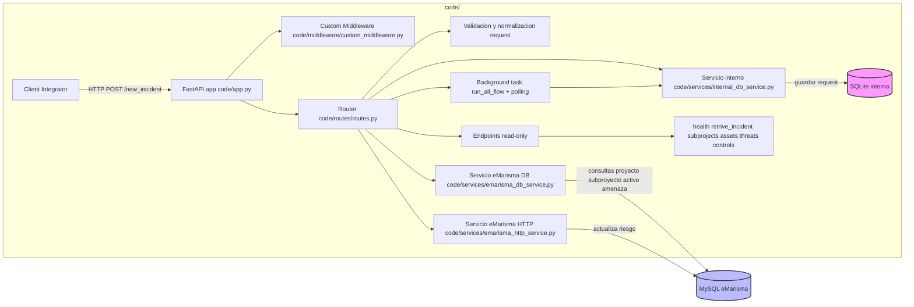

# MiddlewareMarisma

Middleware para gestión de incidentes de seguridad/integración con eMarisma.

## Resumen del proyecto

Este proyecto implementa una API REST en Python (FastAPI) que recibe incidentes de seguridad, consulta y actualiza información de riesgo en eMarisma y mantiene trazabilidad en una base de datos interna (SQLite). El flujo está diseñado para:

- Validar entrada y datos de proyecto/subproyecto/activo
- Calcular valores previos y nuevos de riesgo
- Ejecutar un pipeline de actualización de riesgo en eMarisma
- Registrar la petición y estado en BD interna
- Exponer endpoint de consulta del estado/resultados

> El contenido del directorio `study-case/` no requiere documentación en este README.

## Arquitectura



## Estructura principal del repositorio

- `/code` (app principal)
  - `app.py` (FastAPI + lifespan startup/shutdown)
  - `routes/routes.py` (API endpoints y flujos incidentes)
  - `config/loader.py` (carga config.json/env)
  - `client/risk_client.py` (cliente HTTP async genérico)
  - `services/emarisma_db_service.py` (consulta eMarisma MySQL)
  - `services/emarisma_http_service.py` (flujo de riesgo y APIs eMarisma)
  - `services/internal_db_service.py` (SQLite interna para trackeo)
  - `middleware/custom_middleware.py` (logging/errores comunes)
  - `Dockerfile`, `docker-compose.yml`, `docker-manage.*`
- `/study-case` (scripts y JSON de prueba, opcional)

## Requisitos previos

- Python 3.11+
- pip
- MySQL eMarisma accesible con credenciales
- Variables con DB eMarisma o `code/config.json`

## Instalación y ejecución

### 1) Entorno virtual (Windows / Linux)

```bash
python -m venv .venv
source .venv/bin/activate  # Linux/Mac
.venv\Scripts\Activate.ps1 # Windows PowerShell
pip install -r code/requirements.txt
```

### 2) Configurar `code/config.json` (o variables de entorno)

```json
{
    "username": "tu_usuario",
    "password": "tu_password",
    "db_host": "host_emarisma",
    "db_port": 3306,
    "db_user": "ar_marisma",
    "db_password": "pass_db",
    "db_name": "ar_marisma"
}
```

### 3) Ejecutar local

```bash
cd code
uvicorn app:app --reload --host 0.0.0.0 --port 8000
```

### 4) Verificar

```bash
curl http://localhost:8000/health
# {"status":"healthy","service":"MiddlewareMarisma"}
```

## Endpoints principales

### POST /new_incident

Inicia la creación de un incidente, persistencia local y ejecución de flujo en segundo plano.

Ejemplo:

```bash
curl -X POST http://localhost:8000/new_incident \
  -H "Content-Type: application/json" \
  -d '{
    "threat_id": "T123456",
    "user_id": "user123",
    "device_id": "deviceABC",
    "detected_at": "2025-10-15T14:22:00Z",
    "threat_type": "Man in the middle",
    "threat_description": "Interceptación de comunicaciones",
    "severity": "grave",
    "actions_taken": "Bloquear enlace y alertar",
    "status": "mitigated",
    "project_name": "Di4SPDS",
    "subproject_name": "SmartHome",
    "cause": "Falta de actualización",
    "controls": "A.05.01;A.05.02"
  }'
```

Respuesta esperada:

```json
{"request_id": 123}
```

### GET /retrive_incident/{request_id}

Consulta estado del procesamiento y valores de riesgo previos/nuevos.

```bash
curl http://localhost:8000/retrive_incident/123
```

### GET /subprojects

Lista subproyectos disponibles.

```bash
curl http://localhost:8000/subprojects
```

### GET /assets/{subproject_name}

Assets por subproyecto.

```bash
curl http://localhost:8000/assets/SmartHome
```

### GET /threats/{subproject}/{asset_id}

Amenazas de un activo.

```bash
curl http://localhost:8000/threats/SmartHome/45
```

### GET /controls/{subproject}/{asset_id}/{threat_id}

Controles mitigación.

```bash
curl http://localhost:8000/controls/SmartHome/45/34
```

### GET /health

Salud del servicio.

```bash
curl http://localhost:8000/health
```

## Flujo de procesamiento completo

1. `new_incident` valida campos y mapea IDs desde `emarisma_db_service`.
2. Se guarda petición interna en SQLite (`internal_db_service.save_request`).
3. Se captura snapshot previo de riesgo (`get_analisis_riesgo_by_activo_amenaza_id`).
4. Se lanza background task `process_incident_flow`:
   - Ejecuta `steps.run_all_flow` sobre eMarisma.
   - Polling para detectar cambios en riesgo (120s max).
   - Actualiza request con riesgo_nuevo y status `completed`.
5. `/retrive_incident` devuelve comparativa `previous` vs `current`.

## Soporte y mantenibilidad

- El middleware registra y controla excepciones.
- Consultas SQL parametrizadas.
- El sistema admite restart con Docker Compose y health checks.
- Mantener actualizado `requirement.txt` y validación de credenciales en `config.json`.
