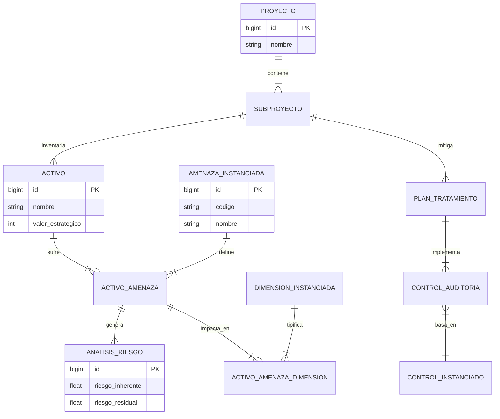
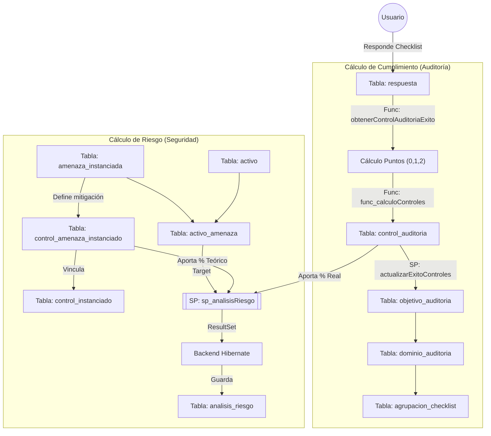

<link rel="stylesheet" href="styles.css">

<div class="cover-page">
    <div class="cover-title">Documentación Técnica</div>
    <div class="cover-subtitle">Análisis de Base de Datos ar_marisma</div>
    <div class="cover-author">Preparado por: Eugenio Romero Ciudad</div>
    <div class="cover-date">Noviembre 2025</div>
</div>

## Análisis de tablas de Base de Datos `ar_marisma`

### 1\. Resumen General del Sistema

El sistema está diseñado para gestionar proyectos de auditoría y análisis de riesgos de seguridad informática. Permite la catalogación de activos, identificación de amenazas, cálculo de riesgos (probabilidad x impacto) y la gestión de planes de tratamiento y controles de seguridad.

**Patrón Arquitectónico Detectado:**
El sistema utiliza un patrón de **"Esquema vs. Instancia"**.

  * Existen tablas de catálogo o plantilla (probablemente sufijadas con `_disponible` o referenciadas en esquemas maestros).
  * Existen tablas **`_instanciada`** (ej. `amenaza_instanciada`, `control_instanciado`). Esto sugiere que cuando se crea un proyecto, se copian las amenazas y controles "plantilla" a tablas específicas del proyecto para poder editarlas sin afectar al catálogo global.

-----

### 2\. Módulos Principales

He agrupado las tablas por funcionalidad lógica para facilitar su comprensión:

#### 2.1. Gestión de Proyectos y Organización

El núcleo administrativo donde se estructura el trabajo.

  * **`proyecto`**: La entidad raíz. Define el alcance y el esquema de seguridad utilizado (ENS, ISO 27001, etc.).
  * **`subproyecto`**: Divisiones lógicas dentro de un proyecto. Aquí parece residir la mayor parte de la lógica operativa.
  * **`cnae`**: Catálogo de la Clasificación Nacional de Actividades Económicas (sector del cliente).
  * **`pais`, `provincia`, `municipio`**: Datos geográficos para ubicación de clientes/proyectos.

#### 2.2. Activos (Inventory)

Gestión de los elementos que se protegen.

  * **`activo`**: La tabla central de inventario (Hardware, Software, Información, etc.).
  * **`tipo_activo_instanciado`**: Categorización del activo en el proyecto.
  * **`activo_compartido`**: Permite que usuarios distintos vean el mismo activo.
  * **`activo_predefinido`**: Plantillas de activos para carga rápida.

#### 2.3. Motor de Análisis de Riesgos

El "corazón" del cálculo del sistema.

  * **`amenaza_instanciada`**: Amenazas potenciales aplicables al proyecto.
  * **`activo_amenaza`**: Tabla pivote (Many-to-Many) que vincula un activo con una amenaza específica. Aquí se suele guardar la probabilidad o valor de la amenaza.
  * **`dimension_instanciada`**: Dimensiones de seguridad (Confidencialidad, Integridad, Disponibilidad, Trazabilidad, Autenticidad).
  * **`activo_amenaza_dimension`**: Valoración del impacto en una dimensión específica para un par activo-amenaza.
  * **`analisis_riesgo`**: Almacena los resultados finales de los cálculos (Riesgo Inherente, Residual, Impacto Total).

#### 2.4. Cumplimiento y Controles

Gestión de medidas de seguridad y auditoría.

  * **`control_instanciado`**: Medidas de seguridad aplicadas.
  * **`checklist_instanciado`**: Listas de comprobación para verificar controles.
  * **`auditoria`**: Registro de evaluaciones formales.
  * **`no_conformidad`**: Desviaciones encontradas y sus acciones correctivas.
  * **`plan_tratamiento`**: Planificación para mitigar los riesgos detectados.

#### 2.5. Seguridad del Sistema (ACL y Usuarios)

Tablas técnicas para el control de acceso a la propia aplicación.

  * **`user`**, **`role`**, **`user_role`**: Gestión clásica de usuarios y permisos.
  * **`acl_sid`, `acl_class`, `acl_object_identity`, `acl_entry`**: Tablas estándar de **Spring Security ACL**. Permiten permisos granulares a nivel de fila (ej: "El usuario X puede ver el Proyecto Y, pero no el Z").

#### 2.6. Vulnerabilidades Técnicas

Integración con herramientas externas o bases de datos de vulnerabilidades.

  * **`cve`, `cve_record`**: Vulnerabilidades y Exposiciones Comunes.
  * **`analisisnmap`, `resultado_puerto`**: Resultados de escaneos de red (Nmap).
  * **`analisisowasp`**: Resultados de análisis web.

-----

### 3\. Diccionario de Datos (Tablas Críticas)

A continuación, se detalla la estructura de las tablas más importantes para el negocio.

#### Tabla: `proyecto`

Define el marco de trabajo general para un cliente.

| Columna                 | Tipo          | Descripción / Notas                                               |
| :---------------------- | :------------ | :---------------------------------------------------------------- |
| `id`                    | BIGINT        | PK, Auto Inc.                                                     |
| `nombre`                | VARCHAR(255)  | Nombre del proyecto.                                              |
| `cnae_id`               | BIGINT        | FK -\> `cnae`. Sector de actividad.                               |
| `esquema_disponible_id` | BIGINT        | FK. Probablemente define la normativa base (ej. ENS Alto, Medio). |
| `alcance`               | VARCHAR(4000) | Descripción textual del alcance del proyecto.                     |

#### Tabla: `activo`

Los elementos sobre los que recae el análisis.

| Columna                      | Tipo         | Descripción / Notas                                          |
| :--------------------------- | :----------- | :----------------------------------------------------------- |
| `id`                         | BIGINT       | PK.                                                          |
| `nombre`                     | VARCHAR(255) | Nombre del activo (ej. "Servidor Web").                      |
| `valor_estrategico`          | INT          | Valoración numérica de importancia (0-10 o escala definida). |
| `tipo_activo_instanciado_id` | BIGINT       | FK. Clasificación del activo.                                |
| `responsable`                | VARCHAR(255) | Persona a cargo del activo.                                  |
| `ubicacion`                  | VARCHAR(255) | Dónde se encuentra físicamente o lógicamente.                |

#### Tabla: `analisis_riesgo`

Almacena la "foto final" del riesgo para un activo y amenaza.

| Columna             | Tipo   | Descripción / Notas                                      |
| :------------------ | :----- | :------------------------------------------------------- |
| `id`                | BIGINT | PK.                                                      |
| `activo_amenaza_id` | BIGINT | FK -\> `activo_amenaza`. El par Activo/Amenaza evaluado. |
| `riesgo_inherente`  | FLOAT  | Riesgo calculado antes de aplicar controles.             |
| `riesgo`            | FLOAT  | Riesgo residual (probablemente).                         |
| `impacto_total`     | FLOAT  | Suma o cálculo de impactos en las dimensiones.           |
| `vulnerabilidad`    | FLOAT  | Factor de vulnerabilidad aplicado.                       |

#### Tabla: `user`

Usuarios del sistema.

| Columna    | Tipo         | Descripción / Notas                                    |
| :--------- | :----------- | :----------------------------------------------------- |
| `id`       | BIGINT       | PK.                                                    |
| `username` | VARCHAR(255) | Login único.                                           |
| `password` | VARCHAR(255) | Hash de la contraseña.                                 |
| `enabled`  | BIT(1)       | Si el usuario está activo.                             |
| `cnae_id`  | BIGINT       | FK. Para segmentar usuarios por sector (posiblemente). |

-----

### 4\. Diagrama Relacional (Core del Análisis de Riesgos)

Este diagrama muestra cómo fluye la información desde el Proyecto hasta el cálculo del Riesgo.



-----

### 5\. Lógica de Negocio y Metodología

El análisis de los datos reales revela que el sistema no sigue una implementación estándar de ISO 27001, sino una **metodología híbrida** que combina catálogos de amenazas estandarizados con un modelo de madurez para los controles.

#### 5.1. Catálogo de Amenazas (Estándar MAGERIT)

Las amenazas se gestionan bajo una codificación estricta `[A.XX]`, lo que indica la utilización del catálogo **MAGERIT** (Metodología de Análisis y Gestión de Riesgos de los Sistemas de Información) o una adaptación directa.

  * **Identificación:** Uso de códigos como `[A.10]`, `[A.11]`.
  * **Estructura:**
      * **Tabla Maestra:** `amenaza_instanciada`.
      * **Herencia:** Las amenazas heredan valores base de probabilidad e impacto (`probabilidad_ocurrencia_instanciada_id`, `porcentaje_degradacion_instanciado_id`) que luego se ajustan al activo específico.

#### 5.2. Controles de Seguridad (Enfoque CMM)

El sistema evalúa la seguridad basándose en un **Modelo de Madurez de Capacidades (CMM)** en lugar de simples listas de verificación binarias.

  * **Codificación:** `CMM-Fase-Dominio-Control` (ej. `CMM-01-01-01`).
  * **Filosofía de Control:**
      * Los controles se definen como "Prácticas" (ej. *"Esta práctica restringe los tipos de cambios permitidos..."*).
      * **Objetivo:** Evaluar si el proceso está definido, gestionado y optimizado, no solo si existe una herramienta técnica instalada.
  * **Jerarquía de Cumplimiento:**
    1.  **Checklist:** Preguntas individuales (SI/NO/PARCIAL).
    2.  **Control:** Agregación de checklists.
    3.  **Objetivo:** Agrupación lógica de controles.
    4.  **Dominio:** Área de conocimiento (ej. "Gestión del Cumplimiento").

#### 5.3. Modelo de Cálculo de Riesgo

La tabla `analisis_riesgo` almacena una matriz multidimensional para cada par Activo-Amenaza.

| Dimensión              | Descripción Técnica                                                                                                                                        |
| :--------------------- | :--------------------------------------------------------------------------------------------------------------------------------------------------------- |
| **Vulnerabilidad (%)** | Grado de exposición calculado (0-100%). Se deriva de la falta de eficacia de los controles implementados (`cobertura` vs `eficacia`).                      |
| **Impacto Total**      | Daño potencial máximo (Escala 0-100).                                                                                                                      |
| **Riesgo Inherente**   | Riesgo base del activo antes de aplicar controles específicos.                                                                                             |
| **Riesgo (Residual)**  | Valor calculado final tras mitigar la amenaza con los controles (`sp_analisisRiesgo`).                                                                     |
| **Valor de Riesgo**    | Nivel normalizado para mapas de calor (Escala detectada: 1 a 5).<br>• **4.0:** Riesgo Alto/Crítico.<br>• **3.0:** Riesgo Medio.<br>• **2.0:** Riesgo Bajo. |

#### 5.4. Arquitectura del Entorno

Los datos de configuración confirman que la base de datos soporta una plataforma **SaaS (Software as a Service)** denominada internamente "Emarisma".

  * **Sistema Operativo Host:** Linux (evidenciado por rutas como `/home/resources/...`).
  * **Integraciones:** Capacidad de escaneo de red activa mediante **NMAP** (`analisisNMAP`).
  * **Gestión de Usuarios:** Lógica compleja de estados de cuenta (`statusLocked`, `statusExpired`, `password_expired`), típica de entornos corporativos con políticas de seguridad estrictas.

## Desglose del flujo de cálculo de Riesgo y Cumplimiento

### 1\. El Átomo del Cálculo: La Respuesta al Checklist

Todo el sistema de cálculo nace de una respuesta simple a una pregunta de auditoría.

Analizando la función `obtenerControlAuditoriaExito`, la lógica de puntuación base es:

  * **SI:** Suma **2 puntos**.
  * **PARCIAL:** Suma **1 punto**.
  * **NO / Otro:** 0 puntos.

**La Fórmula de "Éxito" del Control (`func_calculoControles`)**
Esta función calcula qué tan bien está implantado un control de seguridad (ej. "Tener antivirus").

1.  **Total Posible:** Cuenta cuántas preguntas (`checklist_instanciado`) tiene asociadas ese control y las multiplica por 2 (puntuación máxima posible).
2.  **Puntuación Real:** Suma los puntos de las respuestas (SI=2, PARCIAL=1).
3.  **Resultado:** $\frac{\text{Puntuación Real}}{\text{Total Posible}} \times 100$

> **Nota Crítica:** La función tiene una validación interna (`@varAuxiliar`). Compara el número de preguntas *totales* contra las preguntas *respondidas*. Si no se han respondido todas las preguntas obligatorias (`aplica='SI'`), el éxito puede forzarse a nulo o cero dependiendo de la lógica condicional compleja en el `SELECT` interno.

-----

### 2\. La Propagación del Cumplimiento (Bottom-Up)

Una vez que un control tiene un valor de éxito (0-100%), el procedimiento `actualizarExitoControles` se encarga de propagar ese dato hacia arriba en la jerarquía normativa.

El flujo es **escalonado** usando medias aritméticas:

1.  **Nivel 1 (Control):** Se calcula con la fórmula anterior.
2.  **Nivel 2 (Objetivo):** Se actualiza la tabla `objetivo_auditoria`.
      * *Cálculo:* Promedio del `exito` de todos los controles hijos.
3.  **Nivel 3 (Dominio):** Se actualiza la tabla `dominio_auditoria`.
      * *Cálculo:* Promedio del `exito` de todos los objetivos hijos.
4.  **Nivel 4 (Agrupación/Proyecto):** Se actualiza la tabla `agrupacion_checklist`.
      * *Cálculo:* Promedio del `exito` de todos los dominios.

Este procedimiento utiliza un **cursor** (`recorre`) para iterar control por control y disparar la actualización en cadena.

-----

### 3\. La Lógica del Análisis de Riesgo (`sp_analisisRiesgo`)

Este es el procedimiento más crítico para tu pregunta. Curiosamente, este SP **no actualiza** la tabla `analisis_riesgo` directamente, sino que devuelve un `ResultSet` (una tabla en memoria) para que Hibernate la procese.

**¿Cómo conecta los Activos con las Amenazas y los Controles?**
El SP `sp_analisisRiesgo` realiza un *JOIN* masivo para responder a la pregunta: *"¿Cuánto estoy mitigando una amenaza específica sobre un activo específico?"*

La lógica de cruce es:

1.  **Activo** (`activo_amenaza`) tiene una **Amenaza**.
2.  Esa **Amenaza** se mitiga mediante varios **Controles** (tabla `control_amenaza_instanciado`).
3.  Esos **Controles** tienen un estado de implementación real en la auditoría actual (`control_auditoria`).

**El Cálculo de la Mitigación:**
El procedimiento devuelve columnas clave agrupadas por `activo_amenaza_id`:

  * **`cobertura`**: `sum(a.cobertura)/count(*)`
      * Calcula el **promedio de implementación** de todos los controles que supuestamente mitigan esa amenaza.
  * **`porcentaje`**: `sum(a.porcentaje)/count(*)`
      * Viene de `control_amenaza_instanciado`. Esto representa la **eficacia teórica** del control. (Ej: Un firewall mitiga el 80% de un ataque de red, pero un antivirus solo el 10%).

**Interpretación para Java:**
Hibernate recibe esta lista y probablemente hace el cálculo final del **Riesgo Residual** en el código Java así:

$$RiesgoResidual = (Impacto \times Probabilidad) \times (1 - (\text{CoberturaReal} \times \text{EficaciaTeorica}))$$

-----

### 4\. El "Árbol" Visual (`sp_actualizarExitoArbol`)

El sistema tiene una tabla `nodo_arbol` que parece alimentar una interfaz visual de carpetas o jerarquía de proyecto.

El procedimiento `sp_actualizarExitoArbol` es **recursivo** (aunque implementado con un bucle `LOOP` para evitar límites de recursión de pila en MySQL).

1.  Toma el ID de un subproyecto.
2.  Busca el nodo padre en el árbol.
3.  Calcula la media de los hijos.
4.  Sube un nivel (`padreRama = existePadre`).
5.  Repite el cálculo hasta llegar a la raíz (`padre = 0`).

Esto asegura que si cambias una respuesta en un checklist, la barra de progreso de la carpeta raíz del proyecto se actualice automáticamente.

-----

### 5\. Diagrama de Flujo de Datos (Cálculo)

Aquí tienes cómo fluye el dato desde que el usuario marca una casilla hasta que se calcula el riesgo.



-----

## Extracción de resultados de analisis

Este apartado detalla cómo el middleware recupera los datos de riesgo ya calculados y persistidos por el motor principal.

### 1\. Arquitectura de Datos

El sistema sigue un modelo de **Consistencia Eventual** gestionado por estados:

1.  Se produce un cambio en los datos (ej. se responde un checklist).
2.  El motor Java/Hibernate procesa la lógica de negocio y actualiza la tabla `analisis_riesgo`.
3.  El middleware consulta esta tabla para obtener la "foto fija" actual del riesgo sin realizar operaciones matemáticas, garantizando que el usuario ve exactamente el mismo dato que en la aplicación principal.

### 2\. Consulta SQL de Recuperación

Esta consulta recupera los valores finales almacenados en la tabla `analisis_riesgo` vinculándolos con la información descriptiva del Activo y la Amenaza.

**Parámetro requerido:** `:subproyecto_id`

```sql
SELECT 
    -- 1. CONTEXTO DEL RIESGO
    ami.subproyecto_id,
    ar.activo_amenaza_id,
    act.nombre AS nombre_activo,
    act.valor_estrategico,
    ami.codigo AS codigo_amenaza,
    ami.nombre AS nombre_amenaza,

    -- 2. MÉTRICAS PERSISTIDAS (Valores de Hibernate)
    ar.riesgo_inherente,          -- Riesgo base calculado por el motor
    ar.impacto_total,             -- Impacto máximo potencial
    ar.vulnerabilidad,            -- % de exposición (0-100)
    
    -- 3. RESULTADO FINAL
    ar.riesgo AS riesgo_residual,    -- Valor numérico final del riesgo
    ar.valor_riesgo AS nivel_riesgo  -- Escala normalizada (0-4) para semáforos

FROM ar_marisma.analisis_riesgo ar
    -- Relación con la tabla puente Activo-Amenaza
    INNER JOIN ar_marisma.activo_amenaza am ON ar.activo_amenaza_id = am.id
    -- Obtener nombre del Activo
    INNER JOIN ar_marisma.activo act ON am.activo_id = act.id
    -- Obtener nombre de la Amenaza y filtrar por Subproyecto
    INNER JOIN ar_marisma.amenaza_instanciada ami ON am.amenaza_instanciada_id = ami.id

WHERE 
    ar.deleted = 0 
    AND am.deleted = 0
    AND ami.subproyecto_id = :subproyecto_id;
```

### 3\. Diccionario de Datos Recuperados

Basado en la estructura de la tabla `analisis_riesgo` y los datos reales extraídos:

| Campo | Descripción Funcional | Ejemplo de Valor |
| :--- | :--- | :--- |
| `nombre_activo` | Elemento protegido. | "Prueba" |
| `codigo_amenaza` | Identificador MAGERIT de la amenaza. | "[A.10]" |
| `riesgo_inherente` | Valor base del riesgo calculado por el motor antes de mitigaciones completas. | 13.5 |
| `impacto_total` | Escala de daño potencial (Generalmente 0-100). | 60.0 |
| `vulnerabilidad` | Porcentaje de exposición del activo dada la eficacia de los controles. | 37.5 (representa un 37.5% de exposición) |
| `riesgo_residual` | **Valor Final**. Magnitud matemática del riesgo actual. | 36.0 |
| `nivel_riesgo` | Clasificación discreta para visualización (Semáforo). | 4.0 |

### 4\. Interpretación de Niveles (Semáforo)

Analizando los datos reales del sistema, la columna `nivel_riesgo` (`valor_riesgo` en BD) utiliza una escala numérica de **0.0 a 4.0**.

El middleware debe mapear estos valores a la interfaz de usuario de la siguiente manera:

| Nivel (`nivel_riesgo`) | Clasificación | Color Recomendado | Descripción |
| :---: | :--- | :--- | :--- |
| **4.0** | **Crítico / Muy Alto** | 🔴 Rojo | Amenazas con alto impacto o vulnerabilidad total (ej. Robo con 100% vul). |
| **3.0** | **Alto** | 🟠 Naranja | Riesgos significativos que requieren gestión. |
| **2.0** | **Medio** | 🟡 Amarillo | Riesgo moderado. |
| **1.0** | **Bajo** | 🟢 Verde Claro | Riesgo controlado. |
| **0.0** | **Insignificante** | 🟢 Verde Oscuro | Amenaza residual despreciable o nula. |

### 5\. Consideraciones de Integración

  * **Latencia:** Los datos son consistentes con el último cálculo finalizado por el backend Java. Puede existir un ligero retraso entre la modificación de un checklist y la actualización de estos valores.
  * **Integridad:** Si un registro no aparece en esta consulta para un par Activo-Amenaza existente, significa que el motor de análisis aún no ha procesado dicho riesgo (estado pendiente de cálculo).