# Análisis del comportamiento lógico de eMARISMA

## Contenido
1. Inicio de sesión
2. Mis proyectos
3. Mis subproyectos
4. Flujo de actividad
5. Incidentes
6. Nuevo incidente
7. Completar incidencia (Ir a taxonomía)
8. Añadir amenaza
9. Vincular activo
10. Rellenar formulario de dimensiones y guardar
11. Vincular control (para cada control existente)
12. Ir a conclusión
13. Rellenar formulario, guardar y cerrar
14. Recalcular (opción 1)
15. Recalcular (opción 2)
16. Cerrar sesión

## 1. Inicio de sesión
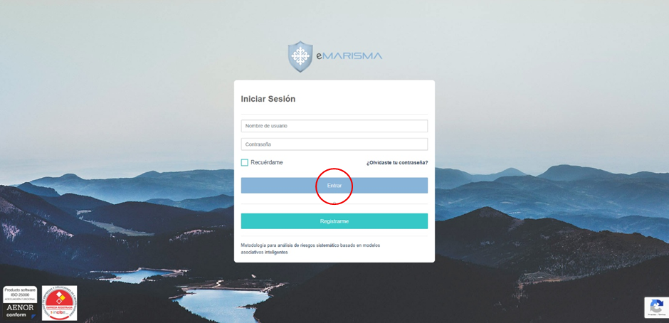

### Error de inicio de sesión
Al intentar capturar las peticiones desde Burpsuite, reCAPTCHA nos lanza el siguiente  error:

    &g-recaptcha-response=0cAFcWeA5ihZy-[...]W4GEaPwi&postUrl=%2Flogin%2Fauthenticate

#### Solución del error de reCAPTCHA
1. Instalación de certificado de Burpsuite: soluciona parte del problema. `&g-recaptcha-response=&postUrl=%2Flogin%2Fauthenticate` ahora recaptcha-response viene vacío.
2. TLS passthrough: `&g-recaptcha-response=0cAFcWeA4Y76O2xa[...]uwAnfk&postUrl=%2Flogin%2Fauthenticate` ahora la respuesta llega completa y con `authenticate`.

### Iniciar sesión
Para iniciar sesión utiliza tres endpoints, en primer lugar el endpoint de la página del formulario de login:
```
GET /login/auth HTTP/1.1
Host: 172.20.48.129:8090
Cache-Control: max-age=0
Upgrade-Insecure-Requests: 1
User-Agent: Mozilla/5.0 (Windows NT 10.0; Win64; x64) AppleWebKit/537.36 (KHTML, like Gecko) Chrome/142.0.0.0 Safari/537.36
Accept: text/html,application/xhtml+xml,application/xml;q=0.9,image/avif,image/webp,image/apng,*/*;q=0.8,application/signed-exchange;v=b3;q=0.7
Accept-Encoding: gzip, deflate, br
Accept-Language: es-ES,es;q=0.9
Cookie: _ga=GA1.1.1975039891.1762334083; _gid=GA1.1.1892053111.1764845776; JSESSIONID=871D3CB08998BE10814A05873A667FDE; _gat_UA-97814751-2=1; _gat_gtag_UA_97814751_2=1; _ga_55LR48RTVX=GS2.1.s1764924195$o19$g1$t1764924702$j41$l0$h0
Connection: keep-alive
```

Después pasa al siguiente endpoint en el que se le pasa el usuario y contraseña, la contraseña codificada en base 64:

```
POST /login/existUser HTTP/1.1
Host: 172.20.48.129:8090
Content-Length: 48
X-Requested-With: XMLHttpRequest
User-Agent: Mozilla/5.0 (Windows NT 10.0; Win64; x64) AppleWebKit/537.36 (KHTML, like Gecko) Chrome/142.0.0.0 Safari/537.36
Accept: */*
Content-Type: application/x-www-form-urlencoded; charset=UTF-8
Origin: http://172.20.48.129:8090
Referer: http://172.20.48.129:8090/login/auth
Accept-Encoding: gzip, deflate, br
Accept-Language: es-ES,es;q=0.9
Cookie: _ga=GA1.1.1975039891.1762334083; _gid=GA1.1.1892053111.1764845776; JSESSIONID=DF52D649E84DB875DB9FD00D921C4AE1; _ga_55LR48RTVX=GS2.1.s1764924195$o19$g0$t1764924200$j55$l0$h0
Connection: keep-alive

username=uclm_user&password=d30nRCQyVm5Ocis5fic0
```

Y, por último, el endpoint en el que se comprueba que autentica al usuario, en el que de nuevo se envían usuario y contraseña, en este caso convirtiendo la contraseña a URL encoding, y enviando también la URL del endpoint:

```
POST /login/authenticate HTTP/1.1
Host: 172.20.48.129:8090
Content-Length: 87
Cache-Control: max-age=0
Origin: http://172.20.48.129:8090
Content-Type: application/x-www-form-urlencoded
Upgrade-Insecure-Requests: 1
User-Agent: Mozilla/5.0 (Windows NT 10.0; Win64; x64) AppleWebKit/537.36 (KHTML, like Gecko) Chrome/142.0.0.0 Safari/537.36
Accept: text/html,application/xhtml+xml,application/xml;q=0.9,image/avif,image/webp,image/apng,*/*;q=0.8,application/signed-exchange;v=b3;q=0.7
Referer: http://172.20.48.129:8090/login/auth
Accept-Encoding: gzip, deflate, br
Accept-Language: es-ES,es;q=0.9
Cookie: _ga=GA1.1.1975039891.1762334083; _gid=GA1.1.1892053111.1764845776; JSESSIONID=DF52D649E84DB875DB9FD00D921C4AE1; _ga_55LR48RTVX=GS2.1.s1764924195$o19$g0$t1764924200$j55$l0$h0
Connection: keep-alive

username=uclm_user&password=w%7D%27D%242VnNr%2B9%7E%274&postUrl=%2Flogin%2Fauthenticate
```

### Respuesta al inciar sesión

De los endpoints anteriores, el que realiza el inicio de sesión es el POST /login/authenticate, cuando se ejecuta, la respuesta recibida es el código HTTP 302, que nos indica que se ha producido una redirección, en este caso se redirige al siguiente endpoint del flujo que estamos siguiendo.

### Cómo iniciar sesión
```
POST /login/existUser HTTP/1.1
Host: 172.20.48.129:8090
Content-Length: 44
X-Requested-With: XMLHttpRequest
User-Agent: Mozilla/5.0 (Windows NT 10.0; Win64; x64) AppleWebKit/537.36 (KHTML, like Gecko) Chrome/142.0.0.0 Safari/537.36 Edg/142.0.0.0
Accept: */*
Content-Type: application/x-www-form-urlencoded; charset=UTF-8
Origin: http://172.20.48.129:8090
Referer: http://172.20.48.129:8090/login/auth
Accept-Encoding: gzip, deflate, br
Accept-Language: es,es-ES;q=0.9,en;q=0.8,en-GB;q=0.7,en-US;q=0.6
Connection: keep-alive

username=Con_premium&password=UzUkZTM1Ym4%3D
```
- Se hace peticion POST a /login/existUser
- con los argumentos: username=<usuario>&password=<password_cifrada>

### Respuesta recibida tras iniciar sesión
```
HTTP/1.1 200 
X-Frame-Options: DENY
X-Application-Context: application:production:9003
Content-Type: text/html;charset=UTF-8
Content-Language: es
Date: Thu, 06 Nov 2025 11:48:11 GMT
Keep-Alive: timeout=20
Connection: keep-alive
Content-Length: 10963

<!DOCTYPE HTML>
<html lang="es">
<head>
    <meta content="text/html; charset=UTF-8; X-Content-Type-Options=nosniff; X-XSS-Protection: 1; mode=block">
    <meta name="viewport" content="width=device-width, initial-scale=1.0">
    <link rel="shortcut icon" href="/assets/favicon-964ac669ddb70c019ef531dd0aed5b2d.png" type="image/x-icon">
    <title>Identifícate</title>

    <script type="text/javascript" src="/assets/jquery/js/jquery.min-fcc54bed9a20031348d8ac4d62f5d2d0.js" ></script>

    <link rel="stylesheet" href="/assets/bootstrap/css/bootstrap.min-5a1f81d1637da1e1ef027803feeb7b40.css"/>
    <script type="text/javascript" src="/assets/bootstrap/js/bootstrap.min-e55fb8fd998e9ea45a80b89f6035c1b2.js" ></script>

    <link rel="stylesheet" href="/assets/assets/css/color-4-f8f6ed8ff6b432bf1de53c929b68bce3.css"/>
    <link rel="stylesheet" href="/assets/assets/css/component-f8e92f44f9e5179b487ca7e1e60f7c3e.css"/>
    <link rel="stylesheet" href="/assets/assets/css/fancy-buttons-18914b3c853e9daa59c4d837b4cb0002.css"/>
    <link rel="stylesheet" href="/assets/assets/css/spinkit-aebde4f96bad5952012bd2bde32db86f.css"/>
    <link rel="stylesheet" href="/assets/assets/css/style-e9a4811e573463fa5b822cddb184caa5.css"/>

    <link rel="stylesheet" href="/assets/assets/icon/icofont/css/icofont-aa2742e4532f5ac0b0aa765339ab7c86.css"/>
    <link rel="stylesheet" href="/assets/assets/icon/font-awesome/css/font-awesome.min-e2a739fe5aa851c5a4dc99e94504ef51.css"/>
    <link rel="stylesheet" href="/assets/assets/icon/glyphicons/css/bootstrap-glyphicons.min-5113a3e19ba33f92a310976e9a6b1eed.css"/>
    <link rel="stylesheet" href="/assets/assets/icon/ionicons/css/ionicons-ffa032d572b50589ad37f081283446d5.css"/>
    <link rel="stylesheet" href="/assets/assets/icon/linearicons/css/linearicons-d09aabe84e6d0fb66a8df49d1072a4cd.css"/>
    <link rel="stylesheet" href="/assets/assets/icon/simple-line-icons/css/simple-line-icons-8150ec045e1bd12b1e00745139b7915a.css"/>
    <link rel="stylesheet" href="/assets/assets/icon/themify-icons/css/themify-icons-d67635f44bd694c5c47232f7c0fb8f1d.css"/>

    <link rel="stylesheet" href="/assets/sweetalert2/css/sweetalert2.min-0d42a0a4aa68e10ed8413c2146028a72.css"/>
    <script type="text/javascript" src="/assets/sweetalert2/js/sweetalert2.min-411457e7bd3c617040db47636b7f811b.js" ></script>

    <link rel="stylesheet" href="/assets/select2/css/select2.min-426f56552ce56a3217f3b3f1be2dceec.css"/>
    <script type="text/javascript" src="/assets/select2/js/select2.full.min-362b5a6f27d30323cb7527b0cae0a4ac.js" ></script>

    <style>
        .alert {
            margin-bottom: 0 !important;
            width: 100% !important;
            text-align: left !important;
        }
        ul#country-listbox {
            color: #495057 !important;
        }
        #imgIso {
            z-index: 99999999999999;
            position: absolute;
            width: 100px;
            bottom: 7px;
            left: 7px;
        }
        #imgSello {
            z-index: 99999999999999;
            position: absolute;
            width: 100px;
            bottom: 7px;
            left: 120px;
        }
    </style>

    
        <script src="https://www.google.com/recaptcha/api.js?render=6LdOYd4UAAAAAJp9Z0nvTa8Y9xYqE_q6NHRSGiyq"></script>
    

    
    <meta name="layout" content="main-login"/>
    
    <link rel="stylesheet" href="/assets/application-83522687ffd906cd13e848b53c0db118.css"/>

</head>
<body>
<div id="loading">
    <div id="loadingSquare">
        <h2 class="texto-loading">
            <div class="img-loading" style="margin-bottom: 10px"></div>
            <span class="texto" id="loadingText">Cargando ...</span>
        </h2>
    </div>
</div>


<a href="https://www.incibe.es/protege-tu-empresa/catalogo-de-ciberseguridad/listado-empresas/marisma-shield-sl" target="_blank"></a>

    
<div class="fix-menu">
    <div class="login p-fixed d-flex text-center bg-primary common-img-bg">
        <div class="container-fluid">
            <div class="row">
                <div class="col-sm-12">
                    <div class="login-card card-block auth-body">
                        <div class="text-center">
                            
                            <div class="col-sm-12 container-client">
                            </div>
                        </div>

                        <div class="auth-box">
                            <form id="form-signin" class="form-signin" action="/login/authenticate" method="POST" autocomplete="off">
                                <div class="row m-b-20">
                                    <div class="col-md-12">
                                        <h3 class="text-left txt-primary">Iniciar Sesión</h3>
                                    </div>
                                </div>
                                <hr/>
                                
                                
                                <div class="input-group">
                                    <input type="text" class="form-control" name="username" id="username" placeholder="Nombre de usuario" />
                                    <span class="md-line"></span>
                                </div>
                                <div class="input-group">
                                    <input type="password" class="form-control" name="password" id="password" placeholder="Contraseña" onchange="$(this).attr('data-p', window.btoa(this.value))" />
                                    <span class="md-line"></span>
                                </div>
                                <div class="row m-t-25 text-left">
                                    <div class="col-sm-7 col-xs-12">
                                        <div class="checkbox-fade fade-in-primary">
                                            <label>
                                                <input type="checkbox" name="remember-me" id="remember_me" />
                                                <span class="cr"><i class="cr-icon icofont icofont-ui-check txt-primary"></i></span>
                                                <span class="text-inverse">Recuérdame</span>
                                            </label>
                                        </div>
                                    </div>
                                    <div class="col-sm-5 col-xs-12 forgot-phone text-right">
                                        <a href="/senderNewPass/index" class="text-right f-w-600 text-inverse"> ¿Olvidaste tu contraseña?</a>
                                    </div>
                                </div>
                                <div class="row m-t-25">
                                    <div class="col-md-12">
                                        <input type="text" class="d-none" id="g-recaptcha-response" name="g-recaptcha-response" />
                                        <input type="text" class="d-none" id="postUrl" name="postUrl" value="/login/authenticate" />
                                        <input type="submit" onclick="loading('Cargando ...')" id="submit" value="Entrar" class="btn btn-info btn-md btn-block waves-effect text-center m-b-20" />
                                    </div>
                                </div>

                                
                                    <div class="login-or">
                                        <hr class="hr-or">
                                        <span class="span-or">o</span>
                                    </div>

                                    <div class="row m-t-15">
                                        <div class="col-md-12">
                                            <a href="/login/register" onclick="loading('Cargando ...')" class="btn btn-primary btn-md btn-block waves-effect text-center m-b-20">Registrarme</a>
                                        </div>
                                    </div>
                                

                                <hr style="margin-top: 0px !important;" />

                                <div class="row">
                                    <div class="col-md-10">
                                        <p class="text-inverse text-left m-b-0">Metodología para análisis de riesgos sistemático basado en modelos asociativos inteligentes</p>
                                    </div>
                                </div>
                            </form>
                        </div>
                    </div>
                </div>
            </div>
        </div>
    </div>
</div>

<script>
    $(document).ready(function() {
        grecaptcha.ready(function() {
            grecaptcha.execute('6LdOYd4UAAAAAJp9Z0nvTa8Y9xYqE_q6NHRSGiyq', {action: 'authenticate'}).then(function(token) {
                $("#g-recaptcha-response").val(token);
            });
        });

        $.ajax({
            dataType: 'json',
            type: "GET",
            url: "/custom/obtenerLogoCliente",
            success: function (data) {
                $.each(data, function(index, value) {
                    if(value.img != null) {
                        $('.login-card .text-center .container-client').append('');
                    }
                });
            }
        });

        setTimeout(function() { $('#username').focus() }, 500);
    });

    $(document).on('click', '#submit', function() {
        loading('Cargando ...');
        var username = $('#username').val(), password = $('#password').attr('data-p');

        if (password) {
            $.ajax({
                type: "POST",
                async: false,
                url: "/login/existUser",
                data: {"username": username, "password": password},
                success: function (data) {
                    if (data.status !== 'ok') {
                        loading("");
                        return false;
                    }
                }
            });
        }
    });
</script>


<script>
    function loading(text) {
        if (text !== null && text !== "" && text !== undefined) {
            $("#loadingText").text(text);
            $("#loading").css("display", "block");
        } else {
            $("#loading").css("display", "none");
        }
    }

    function goBack() {
        window.location = document.referrer;
    }
</script>
</body>
</html>
```

## 2. Mis proyectos
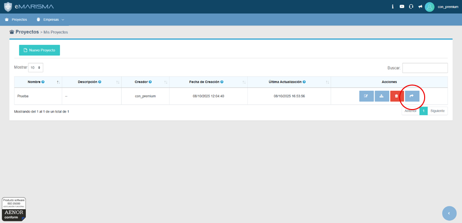
### Acceso al listado de proyectos

#### Petición realizada para acceder al listado de proyectos

```
GET /proyecto/cargarProyectosTabla...
```

#### Reespuesta recibida a la petición

```
{"sEcho":null,"iTotalRecords":1,"iTotalDisplayRecords":1,"aaData":[[1,"Prueba",null,"con_premium","2025-10-08T10:04:40Z","2025-12-03T09:01:01Z"]]}
```

### Acceso al proyecto (por índice)

#### Petición realizada para acceder a proyecto

```
GET /proyecto/index/1 HTTP/1.1
Host: 172.20.48.129:8090
Upgrade-Insecure-Requests: 1
User-Agent: Mozilla/5.0 (Windows NT 10.0; Win64; x64) AppleWebKit/537.36 (KHTML, like Gecko) Chrome/142.0.0.0 Safari/537.36 Edg/142.0.0.0
Accept: text/html,application/xhtml+xml,application/xml;q=0.9,image/avif,image/webp,image/apng,*/*;q=0.8,application/signed-exchange;v=b3;q=0.7
Referer: http://172.20.48.129:8090/
Accept-Encoding: gzip, deflate, br
Accept-Language: es,es-ES;q=0.9,en;q=0.8,en-GB;q=0.7,en-US;q=0.6
Cookie: JSESSIONID=65094DE71CF19DF44DFB7B121D4E9914
Connection: keep-alive
```

- Notable que en la petición se cargan por índice `GET /subproyecto/index/<id>`

### Respuesta a la petición de carga de "Obtener Mis Proyectos"
```
HTTP/1.1 200 
X-Frame-Options: DENY
X-Application-Context: application:production:9003
Content-Type: application/json;charset=UTF-8
Date: Fri, 07 Nov 2025 11:36:59 GMT
Keep-Alive: timeout=20
Connection: keep-alive
Content-Length: 28

[{"nombre":"Prueba","id":1}]
```
```
HTTP/1.1 200 
X-Frame-Options: DENY
X-Application-Context: application:production:9003
Content-Type: application/json;charset=UTF-8
Date: Fri, 07 Nov 2025 11:36:59 GMT
Keep-Alive: timeout=20
Connection: keep-alive
Content-Length: 14

{"proyecto":1}
```

## 3. Mis subproyectos
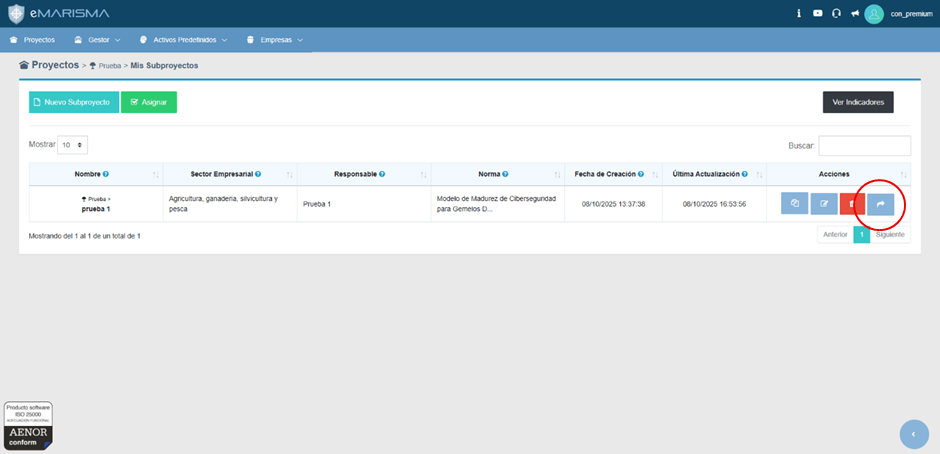
### Acceso al subproyecto

#### Petición realizada para acceder al listado de subproyectos

```
GET /subproyecto/cargarSubproyectosTabla...
```

#### Reespuesta recibida a la petición

```
{"sEcho":null,"iTotalRecords":1,"iTotalDisplayRecords":1,"aaData":[[1,"prueba 1","Agricultura, ganaderia, silvicultura y pesca","Prueba 1","Modelo de Madurez de Ciberseguridad para Gemelos Digitales elaborado por el Industrial IoT Consortium en colaboración con el Digital Twin Consortium","2025-10-08T11:37:38Z","2025-11-26T11:19:17Z",5," <small><i class=\"icofont icofont-tree\"><\/i> Prueba &gt;<\/small>"]]}
```

#### Petición recibida para acceder

```
GET /subproyecto/flowchart/1 HTTP/1.1
Host: 172.20.48.129:8090
Upgrade-Insecure-Requests: 1
User-Agent: Mozilla/5.0 (Windows NT 10.0; Win64; x64) AppleWebKit/537.36 (KHTML, like Gecko) Chrome/142.0.0.0 Safari/537.36 Edg/142.0.0.0
Accept: text/html,application/xhtml+xml,application/xml;q=0.9,image/avif,image/webp,image/apng,*/*;q=0.8,application/signed-exchange;v=b3;q=0.7
Referer: http://172.20.48.129:8090/subproyecto/index/1
Accept-Encoding: gzip, deflate, br
Accept-Language: es,es-ES;q=0.9,en;q=0.8,en-GB;q=0.7,en-US;q=0.6
Cookie: JSESSIONID=65094DE71CF19DF44DFB7B121D4E9914
Connection: keep-alive
```

- Se selecciona el subproyecto por id: `GET /subproyecto/flowchart/<id>`

### Respuesta a la petición de carga de "Obtener Proyecto"
```
HTTP/1.1 200 
X-Frame-Options: DENY
X-Application-Context: application:production:9003
Content-Type: application/json;charset=UTF-8
Date: Fri, 07 Nov 2025 11:44:38 GMT
Keep-Alive: timeout=20
Connection: keep-alive
Content-Length: 412

{"sEcho":null,"iTotalRecords":1,"iTotalDisplayRecords":1,"aaData":[[1,"prueba 1","Agricultura, ganaderia, silvicultura y pesca","Prueba 1","Modelo de Madurez de Ciberseguridad para Gemelos Digitales elaborado por el Industrial IoT Consortium en colaboración con el Digital Twin Consortium","2025-10-08T11:37:38Z","2025-11-07T08:11:51Z",5," <small><i class=\"icofont icofont-tree\"><\/i> Prueba &gt;<\/small>"]]}
```

## 4. Flujo de actividad
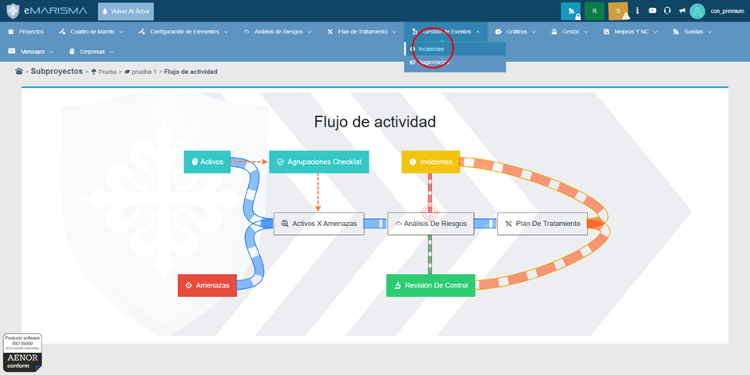
### Acceso a incidentes
```
GET /evento/index/1 HTTP/1.1
Host: 172.20.48.129:8090
Upgrade-Insecure-Requests: 1
User-Agent: Mozilla/5.0 (Windows NT 10.0; Win64; x64) AppleWebKit/537.36 (KHTML, like Gecko) Chrome/142.0.0.0 Safari/537.36 Edg/142.0.0.0
Accept: text/html,application/xhtml+xml,application/xml;q=0.9,image/avif,image/webp,image/apng,*/*;q=0.8,application/signed-exchange;v=b3;q=0.7
Referer: http://172.20.48.129:8090/subproyecto/flowchart/1
Accept-Encoding: gzip, deflate, br
Accept-Language: es,es-ES;q=0.9,en;q=0.8,en-GB;q=0.7,en-US;q=0.6
Cookie: JSESSIONID=5F2FB1A223DD6573A46009F3D1ABBFBB
Connection: keep-alive
```

## 5. Incidentes
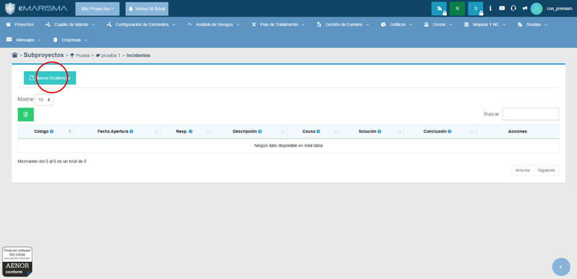

### Clic en "Nueva incidencia"
```
GET /evento/detalle?type=nuevo&a=1&e=0 HTTP/1.1
Host: 172.20.48.129:8090
Upgrade-Insecure-Requests: 1
User-Agent: Mozilla/5.0 (Windows NT 10.0; Win64; x64) AppleWebKit/537.36 (KHTML, like Gecko) Chrome/142.0.0.0 Safari/537.36 Edg/142.0.0.0
Accept: text/html,application/xhtml+xml,application/xml;q=0.9,image/avif,image/webp,image/apng,*/*;q=0.8,application/signed-exchange;v=b3;q=0.7
Referer: http://172.20.48.129:8090/evento/index/1
Accept-Encoding: gzip, deflate, br
Accept-Language: es,es-ES;q=0.9,en;q=0.8,en-GB;q=0.7,en-US;q=0.6
Cookie: JSESSIONID=5F2FB1A223DD6573A46009F3D1ABBFBB
Connection: keep-alive
```

## 6. Nuevo incidente
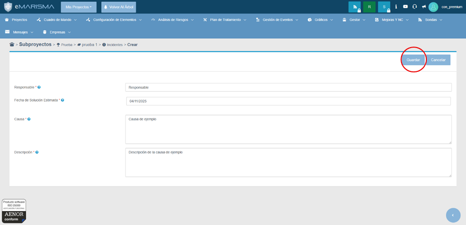

### Guardar nueva incidencia
```
POST /evento/save HTTP/1.1
Host: 172.20.48.129:8090
Content-Length: 156
Cache-Control: max-age=0
Origin: http://172.20.48.129:8090
Content-Type: application/x-www-form-urlencoded
Upgrade-Insecure-Requests: 1
User-Agent: Mozilla/5.0 (Windows NT 10.0; Win64; x64) AppleWebKit/537.36 (KHTML, like Gecko) Chrome/142.0.0.0 Safari/537.36 Edg/142.0.0.0
Accept: text/html,application/xhtml+xml,application/xml;q=0.9,image/avif,image/webp,image/apng,*/*;q=0.8,application/signed-exchange;v=b3;q=0.7
Referer: http://172.20.48.129:8090/evento/detalle?type=nuevo&a=1&e=0
Accept-Encoding: gzip, deflate, br
Accept-Language: es,es-ES;q=0.9,en;q=0.8,en-GB;q=0.7,en-US;q=0.6
Cookie: JSESSIONID=5F2FB1A223DD6573A46009F3D1ABBFBB
Connection: keep-alive

update=Guardar&id=&version=&subproyecto=1&tipo=detalle&typeAction=nuevo&responsable=Responsable&date=07%2F11%2F2025&causa=Causa&descripcion=Descripcion
```

### Recuperar ID de la incidencia para ir a la taxonomía

#### Cargar tabla de eventos
```
GET /evento/cargarEventoTabla/1?draw=1&columns%5B0%5D%5Bdata%5D=0&columns%5B0%5D%5Bname%5D=&columns%5B0%5D%5Bsearchable%5D=false&columns%5B0%5D%5Borderable%5D=true&columns%5B0%5D%5Bsearch%5D%5Bvalue%5D=&columns%5B0%5D%5Bsearch%5D%5Bregex%5D=false&columns%5B1%5D%5Bdata%5D=1&columns%5B1%5D%5Bname%5D=&columns%5B1%5D%5Bsearchable%5D=true&columns%5B1%5D%5Borderable%5D=true&columns%5B1%5D%5Bsearch%5D%5Bvalue%5D=&columns%5B1%5D%5Bsearch%5D%5Bregex%5D=false&columns%5B2%5D%5Bdata%5D=2&columns%5B2%5D%5Bname%5D=&columns%5B2%5D%5Bsearchable%5D=true&columns%5B2%5D%5Borderable%5D=true&columns%5B2%5D%5Bsearch%5D%5Bvalue%5D=&columns%5B2%5D%5Bsearch%5D%5Bregex%5D=false&columns%5B3%5D%5Bdata%5D=3&columns%5B3%5D%5Bname%5D=&columns%5B3%5D%5Bsearchable%5D=true&columns%5B3%5D%5Borderable%5D=true&columns%5B3%5D%5Bsearch%5D%5Bvalue%5D=&columns%5B3%5D%5Bsearch%5D%5Bregex%5D=false&columns%5B4%5D%5Bdata%5D=4&columns%5B4%5D%5Bname%5D=&columns%5B4%5D%5Bsearchable%5D=true&columns%5B4%5D%5Borderable%5D=true&columns%5B4%5D%5Bsearch%5D%5Bvalue%5D=&columns%5B4%5D%5Bsearch%5D%5Bregex%5D=false&columns%5B5%5D%5Bdata%5D=5&columns%5B5%5D%5Bname%5D=&columns%5B5%5D%5Bsearchable%5D=true&columns%5B5%5D%5Borderable%5D=true&columns%5B5%5D%5Bsearch%5D%5Bvalue%5D=&columns%5B5%5D%5Bsearch%5D%5Bregex%5D=false&columns%5B6%5D%5Bdata%5D=6&columns%5B6%5D%5Bname%5D=&columns%5B6%5D%5Bsearchable%5D=true&columns%5B6%5D%5Borderable%5D=true&columns%5B6%5D%5Bsearch%5D%5Bvalue%5D=&columns%5B6%5D%5Bsearch%5D%5Bregex%5D=false&columns%5B7%5D%5Bdata%5D=7&columns%5B7%5D%5Bname%5D=&columns%5B7%5D%5Bsearchable%5D=true&columns%5B7%5D%5Borderable%5D=true&columns%5B7%5D%5Bsearch%5D%5Bvalue%5D=&columns%5B7%5D%5Bsearch%5D%5Bregex%5D=false&columns%5B8%5D%5Bdata%5D=&columns%5B8%5D%5Bname%5D=&columns%5B8%5D%5Bsearchable%5D=true&columns%5B8%5D%5Borderable%5D=false&columns%5B8%5D%5Bsearch%5D%5Bvalue%5D=&columns%5B8%5D%5Bsearch%5D%5Bregex%5D=false&order%5B0%5D%5Bcolumn%5D=1&order%5B0%5D%5Bdir%5D=asc&start=0&length=10&search%5Bvalue%5D=&search%5Bregex%5D=false&_=1762511289408 HTTP/1.1
Host: 172.20.48.129:8090
User-Agent: Mozilla/5.0 (Windows NT 10.0; Win64; x64) AppleWebKit/537.36 (KHTML, like Gecko) Chrome/142.0.0.0 Safari/537.36 Edg/142.0.0.0
Accept: application/json, text/javascript, */*; q=0.01
X-Requested-With: XMLHttpRequest
Referer: http://172.20.48.129:8090/evento/index/1
Accept-Encoding: gzip, deflate, br
Accept-Language: es,es-ES;q=0.9,en;q=0.8,en-GB;q=0.7,en-US;q=0.6
Cookie: JSESSIONID=5F2FB1A223DD6573A46009F3D1ABBFBB
Connection: keep-alive
```

#### Respuesta a la petición de carga de eventos

```
HTTP/1.1 200 
X-Frame-Options: DENY
X-Application-Context: application:production:9003
Content-Type: application/json;charset=UTF-8
Date: Fri, 07 Nov 2025 10:36:56 GMT
Keep-Alive: timeout=20
Connection: keep-alive
Content-Length: 712

Content-Length: 712

{
    "sEcho": null,
    "iTotalRecords": 6,
    "iTotalDisplayRecords": 6,
    "aaData": [
        [
            2,
            "00000012",
            "2025-11-04T12:32:19Z",
            "Responsable",
            "Descripción de la causa de ejemplo",
            "Causa de ejemplo",
            "Solución del incidente",
            "Conclusión del incidente",
            true
        ],
        [
            3,
            "00000013",
            "2025-11-07T07:18:44Z",
            "Responsable",
            "Descripción",
            "Causa incidente",
            "Solución",
            "Conclusión",
            true
        ],
        [
            4,
            "00000014",
            "2025-11-07T08:35:40Z",
            "Responsable1",
            "Descripción1",
            "Causa1",
            null,
            null,
            null
        ],
        [
            5,
            "00000015",
            "2025-11-07T10:24:15Z",
            "Responsable",
            "Descripción",
            "Causa",
            null,
            null,
            null
        ],
        [
            6,
            "00000016",
            "2025-11-07T10:25:32Z",
            "ejemplo",
            "sdfsdfsdfsdf",
            "fsdfsfsf",
            null,
            null,
            null
        ],
        [
            7,
            "00000017",
            "2025-11-07T10:28:04Z",
            "asdsad",
            "asdasdasdsa",
            "asdasdasd",
            null,
            null,
            null
        ]
    ]
}
```
## 7. Completar incidente (Ir a taxonomía)
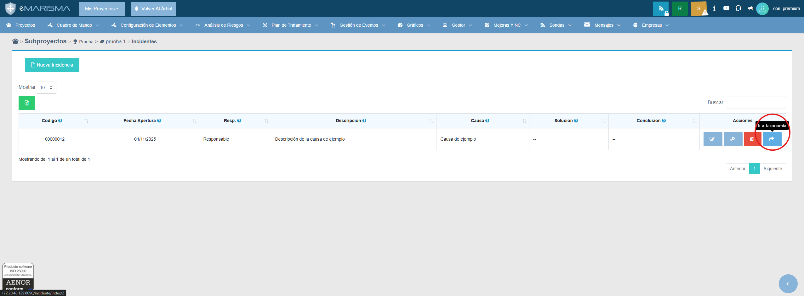
### ¿Que se recibe al entrar en esta sección?
```
GET /incidente/index/2 HTTP/1.1
Host: 172.20.48.129:8090
Upgrade-Insecure-Requests: 1
User-Agent: Mozilla/5.0 (Windows NT 10.0; Win64; x64) AppleWebKit/537.36 (KHTML, like Gecko) Chrome/142.0.0.0 Safari/537.36 Edg/142.0.0.0
Accept: text/html,application/xhtml+xml,application/xml;q=0.9,image/avif,image/webp,image/apng,*/*;q=0.8,application/signed-exchange;v=b3;q=0.7
Referer: http://172.20.48.129:8090/evento/index/1
Accept-Encoding: gzip, deflate, br
Accept-Language: es,es-ES;q=0.9,en;q=0.8,en-GB;q=0.7,en-US;q=0.6
Cookie: JSESSIONID=3454A8C9F02AF56B72FC6D78CF7C3E87; _ga=GA1.1.1791792627.1762429181; _gid=GA1.1.1977960298.1762429181; _gat_UA-97814751-2=1; _gat_gtag_UA_97814751_2=1; _ga_55LR48RTVX=GS2.1.s1762429181$o1$g1$t1762430554$j59$l0$h0
Connection: keep-alive
```
- Se carga el incidente por id: ```GET /incidente/index/<id>```
## 8. Añadir amenaza
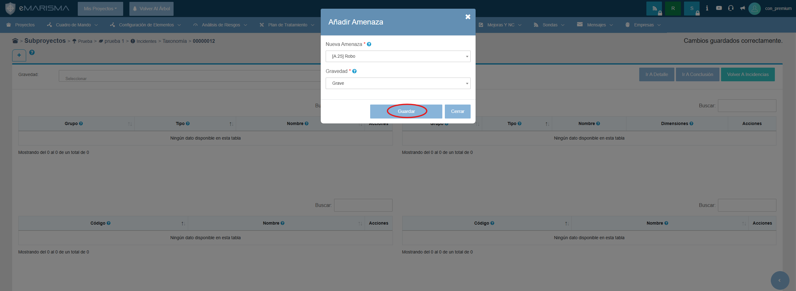
### Al pulsar el botón de guardar:
```
POST /incidente/guardarGravedad?gravedad=grave&incidente=3&subproyecto=1 HTTP/1.1
Host: 172.20.48.129:8090
Content-Length: 0
User-Agent: Mozilla/5.0 (Windows NT 10.0; Win64; x64) AppleWebKit/537.36 (KHTML, like Gecko) Chrome/142.0.0.0 Safari/537.36 Edg/142.0.0.0
Accept: */*
X-Requested-With: XMLHttpRequest
Origin: http://172.20.48.129:8090
Referer: http://172.20.48.129:8090/incidente/index/3
Accept-Encoding: gzip, deflate, br
Accept-Language: es,es-ES;q=0.9,en;q=0.8,en-GB;q=0.7,en-US;q=0.6
Cookie: _ga=GA1.1.1791792627.1762429181; _gid=GA1.1.1977960298.1762429181; JSESSIONID=510A6D0C8E31CEAE7E9E874B51848694; _ga_55LR48RTVX=GS2.1.s1762499598$o2$g1$t1762499999$j60$l0$h0
Connection: keep-alive
```

#### Respuesta al realizar la petición
```
{"msg":"ok"}
```

#### Petición realizada para añadir una amenaza

```
POST /incidente/guardarAmenaza/169
```

#### Respuesta al realizar la petición

```
{"idIncidente":17,"nombreAmenaza":"Alteración de secuencia","gravedad":"leve","msg":"ok"}
```

#### Petición realizada para cargar el incidente

```
GET /incidente/cargarIncidente/12
```

#### Respuesta al realizar la petición

```
{"inciID":12,"amenaza":169,"gravedad":"leve"}
```

- Se guarda la amenaza almacenando la gravedad y el id del incidente y el id del subproyecto por id: ```POST /incidente/guardarGravedad?gravedad=<gravedad_incidente>&incidente=<id_incidente>&subproyecto=<id_subproyecto>```
### Se accede a la taxonomía del incidente y carga toda la web
#### Cargar tabla de controles implicados
```
GET /incidente/cargarTablaControlesImplicados/1?incidente=0&draw=1&columns%5B0%5D%5Bdata%5D=0&columns%5B0%5D%5Bname%5D=&columns%5B0%5D%5Bsearchable%5D=false&columns%5B0%5D%5Borderable%5D=true&columns%5B0%5D%5Bsearch%5D%5Bvalue%5D=&columns%5B0%5D%5Bsearch%5D%5Bregex%5D=false&columns%5B1%5D%5Bdata%5D=&columns%5B1%5D%5Bname%5D=&columns%5B1%5D%5Bsearchable%5D=true&columns%5B1%5D%5Borderable%5D=true&columns%5B1%5D%5Bsearch%5D%5Bvalue%5D=&columns%5B1%5D%5Bsearch%5D%5Bregex%5D=false&columns%5B2%5D%5Bdata%5D=&columns%5B2%5D%5Bname%5D=&columns%5B2%5D%5Bsearchable%5D=true&columns%5B2%5D%5Borderable%5D=true&columns%5B2%5D%5Bsearch%5D%5Bvalue%5D=&columns%5B2%5D%5Bsearch%5D%5Bregex%5D=false&columns%5B3%5D%5Bdata%5D=&columns%5B3%5D%5Bname%5D=&columns%5B3%5D%5Bsearchable%5D=true&columns%5B3%5D%5Borderable%5D=true&columns%5B3%5D%5Bsearch%5D%5Bvalue%5D=&columns%5B3%5D%5Bsearch%5D%5Bregex%5D=false&columns%5B4%5D%5Bdata%5D=&columns%5B4%5D%5Bname%5D=&columns%5B4%5D%5Bsearchable%5D=true&columns%5B4%5D%5Borderable%5D=false&columns%5B4%5D%5Bsearch%5D%5Bvalue%5D=&columns%5B4%5D%5Bsearch%5D%5Bregex%5D=false&order%5B0%5D%5Bcolumn%5D=1&order%5B0%5D%5Bdir%5D=asc&start=0&length=-1&search%5Bvalue%5D=&search%5Bregex%5D=false&_=1762504723766 HTTP/1.1
Host: 172.20.48.129:8090
User-Agent: Mozilla/5.0 (Windows NT 10.0; Win64; x64) AppleWebKit/537.36 (KHTML, like Gecko) Chrome/142.0.0.0 Safari/537.36 Edg/142.0.0.0
Accept: application/json, text/javascript, */*; q=0.01
X-Requested-With: XMLHttpRequest
Referer: http://172.20.48.129:8090/incidente/index/4
Accept-Encoding: gzip, deflate, br
Accept-Language: es,es-ES;q=0.9,en;q=0.8,en-GB;q=0.7,en-US;q=0.6
Cookie: _ga=GA1.1.1791792627.1762429181; _gid=GA1.1.1977960298.1762429181; JSESSIONID=F929DEE0D51EB6F2E5C6CEDF693917CA; _gat_UA-97814751-2=1; _gat_gtag_UA_97814751_2=1; _ga_55LR48RTVX=GS2.1.s1762499598$o2$g1$t1762504723$j60$l0$h0
Connection: keep-alive
```

#### Respuesta al realizar la petición

```
{"sEcho":null,"iTotalRecords":1,"iTotalDisplayRecords":1,"aaData":[[55,"CMM-01-01-01","Programa de Gestión de la Seguridad","Esta práctica restringe los tipos de cambios permitidos, cuándo se pueden realizar esos cambios, los procesos de aprobación y cómo manejar los escenarios de cambios de emergencia.",null]]}
```

#### Cargar tabla de activos implicados
```
GET /incidente/cargarTablaActivosImplicados/1?incidente=0&draw=1&columns%5B0%5D%5Bdata%5D=0&columns%5B0%5D%5Bname%5D=&columns%5B0%5D%5Bsearchable%5D=false&columns%5B0%5D%5Borderable%5D=true&columns%5B0%5D%5Bsearch%5D%5Bvalue%5D=&columns%5B0%5D%5Bsearch%5D%5Bregex%5D=false&columns%5B1%5D%5Bdata%5D=&columns%5B1%5D%5Bname%5D=&columns%5B1%5D%5Bsearchable%5D=true&columns%5B1%5D%5Borderable%5D=true&columns%5B1%5D%5Bsearch%5D%5Bvalue%5D=&columns%5B1%5D%5Bsearch%5D%5Bregex%5D=false&columns%5B2%5D%5Bdata%5D=&columns%5B2%5D%5Bname%5D=&columns%5B2%5D%5Bsearchable%5D=true&columns%5B2%5D%5Borderable%5D=true&columns%5B2%5D%5Bsearch%5D%5Bvalue%5D=&columns%5B2%5D%5Bsearch%5D%5Bregex%5D=false&columns%5B3%5D%5Bdata%5D=&columns%5B3%5D%5Bname%5D=&columns%5B3%5D%5Bsearchable%5D=true&columns%5B3%5D%5Borderable%5D=false&columns%5B3%5D%5Bsearch%5D%5Bvalue%5D=&columns%5B3%5D%5Bsearch%5D%5Bregex%5D=false&columns%5B4%5D%5Bdata%5D=&columns%5B4%5D%5Bname%5D=&columns%5B4%5D%5Bsearchable%5D=true&columns%5B4%5D%5Borderable%5D=false&columns%5B4%5D%5Bsearch%5D%5Bvalue%5D=&columns%5B4%5D%5Bsearch%5D%5Bregex%5D=false&columns%5B5%5D%5Bdata%5D=&columns%5B5%5D%5Bname%5D=&columns%5B5%5D%5Bsearchable%5D=true&columns%5B5%5D%5Borderable%5D=false&columns%5B5%5D%5Bsearch%5D%5Bvalue%5D=&columns%5B5%5D%5Bsearch%5D%5Bregex%5D=false&order%5B0%5D%5Bcolumn%5D=2&order%5B0%5D%5Bdir%5D=asc&start=0&length=-1&search%5Bvalue%5D=&search%5Bregex%5D=false&_=1762504723764 HTTP/1.1
Host: 172.20.48.129:8090
User-Agent: Mozilla/5.0 (Windows NT 10.0; Win64; x64) AppleWebKit/537.36 (KHTML, like Gecko) Chrome/142.0.0.0 Safari/537.36 Edg/142.0.0.0
Accept: application/json, text/javascript, */*; q=0.01
X-Requested-With: XMLHttpRequest
Referer: http://172.20.48.129:8090/incidente/index/4
Accept-Encoding: gzip, deflate, br
Accept-Language: es,es-ES;q=0.9,en;q=0.8,en-GB;q=0.7,en-US;q=0.6
Cookie: _ga=GA1.1.1791792627.1762429181; _gid=GA1.1.1977960298.1762429181; JSESSIONID=F929DEE0D51EB6F2E5C6CEDF693917CA; _gat_UA-97814751-2=1; _gat_gtag_UA_97814751_2=1; _ga_55LR48RTVX=GS2.1.s1762499598$o2$g1$t1762504723$j60$l0$h0
Connection: keep-alive
```

#### Respuesta al realizar la petición

```
{"sEcho":null,"iTotalRecords":3,"iTotalDisplayRecords":3,"aaData":[[13,{"id":1,"estado":"cerrado","cobertura":0.0,"deleted":false,"exito":0.0,"respuestas":[{"id":18},{"id":15},{"id":43},{"id":10},{"id":29},{"id":71},{"id":31},{"id":9},{"id":68},{"id":54},{"id":60},{"id":23},{"id":14},{"id":40},{"id":22},{"id":7},{"id":17},{"id":32},{"id":39},{"id":44},{"id":59},{"id":51},{"id":24},{"id":57},{"id":25},{"id":12},{"id":58},{"id":4},{"id":37},{"id":2},{"id":28},{"id":67},{"id":20},{"id":52},{"id":19},{"id":65},{"id":21},{"id":34},{"id":63},{"id":38},{"id":48},{"id":26},{"id":27},{"id":47},{"id":36},{"id":8},{"id":1},{"id":70},{"id":16},{"id":3},{"id":61},{"id":6},{"id":5},{"id":13},{"id":41},{"id":35},{"id":30},{"id":56},{"id":33},{"id":64},{"id":62},{"id":69},{"id":55},{"id":53},{"id":66},{"id":49},{"id":50},{"id":42},{"id":45},{"id":11},{"id":46}],"nombreGrupoActivos":"Grupo General","incidentesActivo":[{"id":5},{"id":13},{"id":10},{"id":7},{"id":9},{"id":14},{"id":15},{"id":4},{"id":12},{"id":11},{"id":6},{"id":1},{"id":3},{"id":2}],"subproyecto":{"id":1},"activosAuditoria":[{"id":1}],"nombre":"Agrupación CHKL_General [prueba 1]"},"Equipamiento auxiliar","Equipamiento Auxiliar","[[A]]",null],[14,{"id":1,"estado":"cerrado","cobertura":0.0,"deleted":false,"exito":0.0,"respuestas":[{"id":18},{"id":15},{"id":43},{"id":10},{"id":29},{"id":71},{"id":31},{"id":9},{"id":68},{"id":54},{"id":60},{"id":23},{"id":14},{"id":40},{"id":22},{"id":7},{"id":17},{"id":32},{"id":39},{"id":44},{"id":59},{"id":51},{"id":24},{"id":57},{"id":25},{"id":12},{"id":58},{"id":4},{"id":37},{"id":2},{"id":28},{"id":67},{"id":20},{"id":52},{"id":19},{"id":65},{"id":21},{"id":34},{"id":63},{"id":38},{"id":48},{"id":26},{"id":27},{"id":47},{"id":36},{"id":8},{"id":1},{"id":70},{"id":16},{"id":3},{"id":61},{"id":6},{"id":5},{"id":13},{"id":41},{"id":35},{"id":30},{"id":56},{"id":33},{"id":64},{"id":62},{"id":69},{"id":55},{"id":53},{"id":66},{"id":49},{"id":50},{"id":42},{"id":45},{"id":11},{"id":46}],"nombreGrupoActivos":"Grupo General","incidentesActivo":[{"id":5},{"id":13},{"id":10},{"id":7},{"id":9},{"id":14},{"id":15},{"id":4},{"id":12},{"id":11},{"id":6},{"id":1},{"id":3},{"id":2}],"subproyecto":{"id":1},"activosAuditoria":[{"id":1}],"nombre":"Agrupación CHKL_General [prueba 1]"},"Equipamiento auxiliar","Equipamiento Auxiliar","[[A]]",null],[15,{"id":1,"estado":"cerrado","cobertura":0.0,"deleted":false,"exito":0.0,"respuestas":[{"id":18},{"id":15},{"id":43},{"id":10},{"id":29},{"id":71},{"id":31},{"id":9},{"id":68},{"id":54},{"id":60},{"id":23},{"id":14},{"id":40},{"id":22},{"id":7},{"id":17},{"id":32},{"id":39},{"id":44},{"id":59},{"id":51},{"id":24},{"id":57},{"id":25},{"id":12},{"id":58},{"id":4},{"id":37},{"id":2},{"id":28},{"id":67},{"id":20},{"id":52},{"id":19},{"id":65},{"id":21},{"id":34},{"id":63},{"id":38},{"id":48},{"id":26},{"id":27},{"id":47},{"id":36},{"id":8},{"id":1},{"id":70},{"id":16},{"id":3},{"id":61},{"id":6},{"id":5},{"id":13},{"id":41},{"id":35},{"id":30},{"id":56},{"id":33},{"id":64},{"id":62},{"id":69},{"id":55},{"id":53},{"id":66},{"id":49},{"id":50},{"id":42},{"id":45},{"id":11},{"id":46}],"nombreGrupoActivos":"Grupo General","incidentesActivo":[{"id":5},{"id":13},{"id":10},{"id":7},{"id":9},{"id":14},{"id":15},{"id":4},{"id":12},{"id":11},{"id":6},{"id":1},{"id":3},{"id":2}],"subproyecto":{"id":1},"activosAuditoria":[{"id":1}],"nombre":"Agrupación CHKL_General [prueba 1]"},"Equipamiento auxiliar","Equipamiento Auxiliar","[[A]]",null]]}
```

#### Cargar tabla de controles no implicados
```
GET /incidente/cargarTablaControlesNoImplicados/1?incidente=0&draw=1&columns%5B0%5D%5Bdata%5D=0&columns%5B0%5D%5Bname%5D=&columns%5B0%5D%5Bsearchable%5D=false&columns%5B0%5D%5Borderable%5D=true&columns%5B0%5D%5Bsearch%5D%5Bvalue%5D=&columns%5B0%5D%5Bsearch%5D%5Bregex%5D=false&columns%5B1%5D%5Bdata%5D=&columns%5B1%5D%5Bname%5D=&columns%5B1%5D%5Bsearchable%5D=true&columns%5B1%5D%5Borderable%5D=true&columns%5B1%5D%5Bsearch%5D%5Bvalue%5D=&columns%5B1%5D%5Bsearch%5D%5Bregex%5D=false&columns%5B2%5D%5Bdata%5D=&columns%5B2%5D%5Bname%5D=&columns%5B2%5D%5Bsearchable%5D=true&columns%5B2%5D%5Borderable%5D=true&columns%5B2%5D%5Bsearch%5D%5Bvalue%5D=&columns%5B2%5D%5Bsearch%5D%5Bregex%5D=false&columns%5B3%5D%5Bdata%5D=&columns%5B3%5D%5Bname%5D=&columns%5B3%5D%5Bsearchable%5D=true&columns%5B3%5D%5Borderable%5D=true&columns%5B3%5D%5Bsearch%5D%5Bvalue%5D=&columns%5B3%5D%5Bsearch%5D%5Bregex%5D=false&columns%5B4%5D%5Bdata%5D=&columns%5B4%5D%5Bname%5D=&columns%5B4%5D%5Bsearchable%5D=false&columns%5B4%5D%5Borderable%5D=false&columns%5B4%5D%5Bsearch%5D%5Bvalue%5D=&columns%5B4%5D%5Bsearch%5D%5Bregex%5D=false&columns%5B5%5D%5Bdata%5D=&columns%5B5%5D%5Bname%5D=&columns%5B5%5D%5Bsearchable%5D=true&columns%5B5%5D%5Borderable%5D=false&columns%5B5%5D%5Bsearch%5D%5Bvalue%5D=&columns%5B5%5D%5Bsearch%5D%5Bregex%5D=false&order%5B0%5D%5Bcolumn%5D=1&order%5B0%5D%5Bdir%5D=asc&start=0&length=-1&search%5Bvalue%5D=&search%5Bregex%5D=false&_=1762504723765 HTTP/1.1
Host: 172.20.48.129:8090
User-Agent: Mozilla/5.0 (Windows NT 10.0; Win64; x64) AppleWebKit/537.36 (KHTML, like Gecko) Chrome/142.0.0.0 Safari/537.36 Edg/142.0.0.0
Accept: application/json, text/javascript, */*; q=0.01
X-Requested-With: XMLHttpRequest
Referer: http://172.20.48.129:8090/incidente/index/4
Accept-Encoding: gzip, deflate, br
Accept-Language: es,es-ES;q=0.9,en;q=0.8,en-GB;q=0.7,en-US;q=0.6
Cookie: _ga=GA1.1.1791792627.1762429181; _gid=GA1.1.1977960298.1762429181; JSESSIONID=F929DEE0D51EB6F2E5C6CEDF693917CA; _gat_UA-97814751-2=1; _gat_gtag_UA_97814751_2=1; _ga_55LR48RTVX=GS2.1.s1762499598$o2$g1$t1762504723$j60$l0$h0
Connection: keep-alive
```

#### Respuesta al realizar la petición

```
{"sEcho":null,"iTotalRecords":17,"iTotalDisplayRecords":17,"aaData":[[56,"CMM-01-01-02","Gestión del Cumplimiento","Esta práctica es necesaria cuando se necesitan requisitos estrictos para el cumplimiento de los estándares de seguridad en evolución.",null],[57,"CMM-01-02-01","Modelado de Amenazas","Esta práctica tiene como objetivo revelar los factores conocidos y específicos que pueden poner en riesgo el funcionamiento de un sistema dado y describir con precisión estos factores.",null],[58,"CMM-01-02-02","Actitud frente al Riesgo","Esta práctica permite a una organización establecer una estrategia para hacer frente a los riesgos de acuerdo con la política de gestión de riesgos, incluidas las condiciones para la aceptación, evasión, evaluación, mitigación y transferencia.",null],[59,"CMM-01-03-01","Gestión de riesgos de la cadena de suministro de productos","Esta práctica tiene como objetivo revelar los factores conocidos y específicos que pueden poner en riesgo el funcionamiento de un sistema dado y describir con precisión estos factores.",null],[60,"CMM-01-03-02","Gestión de Servicios y Dependencias entre Terceros","Esta práctica aborda la necesidad de generar confianza para los socios y terceras partes. La capacidad de tener la seguridad de la confianza de terceros requiere la comprensión de la infraestructura comercial y de confianza y las posibles fuentes de amenazas ocultas.",null],[61,"CMM-02-01-01","Establecimiento y mantenimiento de identidades","Esta práctica ayuda a identificar y restringir quién puede acceder al sistema y sus privilegios.",null],[62,"CMM-02-01-02","Control de Accesos","La política y la implementación de esta práctica permiten que una empresa limite el acceso a los recursos solo a las identidades específicas que requieren acceso y solo al nivel específico necesario para cumplir con los requisitos de la organización.",null],[64,"CMM-02-02-01","Protección Física","Las políticas de esta práctica abordan la seguridad física y la protección de las instalaciones, su gente y los sistemas para evitar robos y garantizar la operación segura continua del equipo.",null],[63,"CMM-02-02-02","Gestión de activos, cambios y configuración","Esta práctica restringe los tipos de cambios permitidos, cuándo se pueden realizar esos cambios, los procesos de aprobación y cómo manejar los escenarios de cambios de emergencia.",null],[65,"CMM-02-03-01","Modelo y Política de Protección de Datos","Esta práctica identifica si existen diferentes categorías de datos y considera los objetivos y reglas específicas para la protección de datos.",null],[66,"CMM-02-03-02","Implementación de Prácticas de Protección de Datos","Esta práctica describe la aplicación preferida de los mecanismos de protección de datos para abordar la confidencialidad, la integridad y la disponibilidad.",null],[67,"CMM-03-01-01","Evaluación de Vulnerabilidades","Esta práctica ayuda a identificar vulnerabilidades, determinar el riesgo que cada vulnerabilidad supone para el organización y desarrollar un plan de remediación priorizado.",null],[68,"CMM-03-01-02","Gestión de Parches","Esta práctica aclara cuándo y con qué frecuencia aplicar los parches de software, establece procedimientos para parches de emergencia y propone mitigaciones adicionales en caso de acceso restringido al sistema u otros problemas relacionados con la aplicación de parches.",null],[69,"CMM-03-02-01","Prácticas de Monitorización","Esta práctica se utiliza para monitorear el estado del sistema, identificar anomalías y ayudar en la resolución de disputas.",null],[70,"CMM-03-02-02","Concienciación sobre el conexto e Intercambio de Información","Esta práctica ayuda a las organizaciones a estar mejor preparadas para responder a las amenazas. Compartir información sobre amenazas mantiene los sistemas actualizados.",null],[71,"CMM-03-03-01","Detección de Eventos y Plan de Respuestas","Esta práctica define qué es un evento de seguridad y cómo detectar y asignar eventos para su investigación, escalarlos según sea necesario y responder adecuadamente.\r\nTambién debe incluir un plan de comunicaciones para compartir información de manera adecuada y oportuna con las partes interesadas.",null],[72,"CMM-03.03-02","Remediación, Recuperación y Continuidad de Operaciones","Esta práctica es una combinación de redundancias técnicas en las que el personal capacitado y la política de continuidad comercial ayudan a una organización a recuperarse rápidamente de un evento para acelerar el regreso a la normalidad.",null]]}
```

#### Cargar tabla de activos no implicados
```
GET /incidente/cargarTablaActivosNoImplicados/1?incidente=0&draw=1&columns%5B0%5D%5Bdata%5D=0&columns%5B0%5D%5Bname%5D=&columns%5B0%5D%5Bsearchable%5D=false&columns%5B0%5D%5Borderable%5D=true&columns%5B0%5D%5Bsearch%5D%5Bvalue%5D=&columns%5B0%5D%5Bsearch%5D%5Bregex%5D=false&columns%5B1%5D%5Bdata%5D=&columns%5B1%5D%5Bname%5D=&columns%5B1%5D%5Bsearchable%5D=true&columns%5B1%5D%5Borderable%5D=true&columns%5B1%5D%5Bsearch%5D%5Bvalue%5D=&columns%5B1%5D%5Bsearch%5D%5Bregex%5D=false&columns%5B2%5D%5Bdata%5D=&columns%5B2%5D%5Bname%5D=&columns%5B2%5D%5Bsearchable%5D=true&columns%5B2%5D%5Borderable%5D=true&columns%5B2%5D%5Bsearch%5D%5Bvalue%5D=&columns%5B2%5D%5Bsearch%5D%5Bregex%5D=false&columns%5B3%5D%5Bdata%5D=&columns%5B3%5D%5Bname%5D=&columns%5B3%5D%5Bsearchable%5D=true&columns%5B3%5D%5Borderable%5D=true&columns%5B3%5D%5Bsearch%5D%5Bvalue%5D=&columns%5B3%5D%5Bsearch%5D%5Bregex%5D=false&columns%5B4%5D%5Bdata%5D=4&columns%5B4%5D%5Bname%5D=&columns%5B4%5D%5Bsearchable%5D=false&columns%5B4%5D%5Borderable%5D=true&columns%5B4%5D%5Bsearch%5D%5Bvalue%5D=&columns%5B4%5D%5Bsearch%5D%5Bregex%5D=false&columns%5B5%5D%5Bdata%5D=5&columns%5B5%5D%5Bname%5D=&columns%5B5%5D%5Bsearchable%5D=false&columns%5B5%5D%5Borderable%5D=true&columns%5B5%5D%5Bsearch%5D%5Bvalue%5D=&columns%5B5%5D%5Bsearch%5D%5Bregex%5D=false&columns%5B6%5D%5Bdata%5D=&columns%5B6%5D%5Bname%5D=&columns%5B6%5D%5Bsearchable%5D=true&columns%5B6%5D%5Borderable%5D=true&columns%5B6%5D%5Bsearch%5D%5Bvalue%5D=&columns%5B6%5D%5Bsearch%5D%5Bregex%5D=false&columns%5B7%5D%5Bdata%5D=&columns%5B7%5D%5Bname%5D=&columns%5B7%5D%5Bsearchable%5D=true&columns%5B7%5D%5Borderable%5D=true&columns%5B7%5D%5Bsearch%5D%5Bvalue%5D=&columns%5B7%5D%5Bsearch%5D%5Bregex%5D=false&columns%5B8%5D%5Bdata%5D=&columns%5B8%5D%5Bname%5D=&columns%5B8%5D%5Bsearchable%5D=true&columns%5B8%5D%5Borderable%5D=true&columns%5B8%5D%5Bsearch%5D%5Bvalue%5D=&columns%5B8%5D%5Bsearch%5D%5Bregex%5D=false&columns%5B9%5D%5Bdata%5D=9&columns%5B9%5D%5Bname%5D=&columns%5B9%5D%5Bsearchable%5D=false&columns%5B9%5D%5Borderable%5D=true&columns%5B9%5D%5Bsearch%5D%5Bvalue%5D=&columns%5B9%5D%5Bsearch%5D%5Bregex%5D=false&columns%5B10%5D%5Bdata%5D=&columns%5B10%5D%5Bname%5D=&columns%5B10%5D%5Bsearchable%5D=true&columns%5B10%5D%5Borderable%5D=false&columns%5B10%5D%5Bsearch%5D%5Bvalue%5D=&columns%5B10%5D%5Bsearch%5D%5Bregex%5D=false&order%5B0%5D%5Bcolumn%5D=2&order%5B0%5D%5Bdir%5D=asc&start=0&length=-1&search%5Bvalue%5D=&search%5Bregex%5D=false&_=1762504723763 HTTP/1.1
Host: 172.20.48.129:8090
User-Agent: Mozilla/5.0 (Windows NT 10.0; Win64; x64) AppleWebKit/537.36 (KHTML, like Gecko) Chrome/142.0.0.0 Safari/537.36 Edg/142.0.0.0
Accept: application/json, text/javascript, */*; q=0.01
X-Requested-With: XMLHttpRequest
Referer: http://172.20.48.129:8090/incidente/index/4
Accept-Encoding: gzip, deflate, br
Accept-Language: es,es-ES;q=0.9,en;q=0.8,en-GB;q=0.7,en-US;q=0.6
Cookie: _ga=GA1.1.1791792627.1762429181; _gid=GA1.1.1977960298.1762429181; JSESSIONID=F929DEE0D51EB6F2E5C6CEDF693917CA; _gat_UA-97814751-2=1; _gat_gtag_UA_97814751_2=1; _ga_55LR48RTVX=GS2.1.s1762499598$o2$g1$t1762504723$j60$l0$h0
Connection: keep-alive
```

#### Respuesta al realizar la petición

```
{"sEcho":null,"iTotalRecords":0,"iTotalDisplayRecords":0,"aaData":[]}
```

#### Guardar amenaza
```
POST /incidente/guardarAmenaza/170 HTTP/1.1
Host: 172.20.48.129:8090
Content-Length: 23
X-Requested-With: XMLHttpRequest
User-Agent: Mozilla/5.0 (Windows NT 10.0; Win64; x64) AppleWebKit/537.36 (KHTML, like Gecko) Chrome/142.0.0.0 Safari/537.36 Edg/142.0.0.0
Accept: */*
Content-Type: application/x-www-form-urlencoded; charset=UTF-8
Origin: http://172.20.48.129:8090
Referer: http://172.20.48.129:8090/incidente/index/4
Accept-Encoding: gzip, deflate, br
Accept-Language: es,es-ES;q=0.9,en;q=0.8,en-GB;q=0.7,en-US;q=0.6
Cookie: _ga=GA1.1.1791792627.1762429181; _gid=GA1.1.1977960298.1762429181; JSESSIONID=F929DEE0D51EB6F2E5C6CEDF693917CA; _gat_UA-97814751-2=1; _gat_gtag_UA_97814751_2=1; _ga_55LR48RTVX=GS2.1.s1762499598$o2$g1$t1762504723$j60$l0$h0
Connection: keep-alive

gravedad=grave&evento=4
```

#### Activos a vincular
```
HTTP/1.1 200 
X-Frame-Options: DENY
X-Application-Context: application:production:9003
Content-Type: application/json;charset=UTF-8
Date: Fri, 07 Nov 2025 11:48:35 GMT
Keep-Alive: timeout=20
Connection: keep-alive
Content-Length: 1114

{"sEcho":null,"iTotalRecords":1,"iTotalDisplayRecords":1,"aaData":[[1,{"id":1,"estado":"cerrado","cobertura":0.0,"deleted":false,"exito":0.0,"respuestas":[{"id":1},{"id":69},{"id":14},{"id":62},{"id":41},{"id":6},{"id":22},{"id":45},{"id":32},{"id":2},{"id":9},{"id":48},{"id":59},{"id":52},{"id":56},{"id":20},{"id":57},{"id":42},{"id":11},{"id":49},{"id":25},{"id":61},{"id":53},{"id":50},{"id":46},{"id":21},{"id":37},{"id":4},{"id":24},{"id":30},{"id":64},{"id":60},{"id":31},{"id":28},{"id":29},{"id":16},{"id":19},{"id":63},{"id":5},{"id":18},{"id":15},{"id":54},{"id":27},{"id":68},{"id":12},{"id":51},{"id":70},{"id":35},{"id":10},{"id":40},{"id":39},{"id":38},{"id":55},{"id":23},{"id":43},{"id":8},{"id":13},{"id":26},{"id":65},{"id":67},{"id":17},{"id":36},{"id":58},{"id":34},{"id":71},{"id":44},{"id":33},{"id":3},{"id":7},{"id":66},{"id":47}],"nombreGrupoActivos":"Grupo General","incidentesActivo":[{"id":1},{"id":4},{"id":2},{"id":3}],"subproyecto":{"id":1},"activosAuditoria":[{"id":1}],"nombre":"Agrupación CHKL_General [prueba 1]"},"Equipamiento auxiliar","Prueba",null,null,null,null,1,null]]}
```
#### Controles a vincular
```
HTTP/1.1 200 
X-Frame-Options: DENY
X-Application-Context: application:production:9003
Content-Type: application/json;charset=UTF-8
Date: Fri, 07 Nov 2025 11:48:35 GMT
Keep-Alive: timeout=20
Connection: keep-alive
Content-Length: 4855

{"sEcho":null,"iTotalRecords":18,"iTotalDisplayRecords":18,"aaData":[[55,"CMM-01-01-01","Programa de Gestión de la Seguridad","Esta práctica restringe los tipos de cambios permitidos, cuándo se pueden realizar esos cambios, los procesos de aprobación y cómo manejar los escenarios de cambios de emergencia.",null],[56,"CMM-01-01-02","Gestión del Cumplimiento","Esta práctica es necesaria cuando se necesitan requisitos estrictos para el cumplimiento de los estándares de seguridad en evolución.",null],[57,"CMM-01-02-01","Modelado de Amenazas","Esta práctica tiene como objetivo revelar los factores conocidos y específicos que pueden poner en riesgo el funcionamiento de un sistema dado y describir con precisión estos factores.",null],[58,"CMM-01-02-02","Actitud frente al Riesgo","Esta práctica permite a una organización establecer una estrategia para hacer frente a los riesgos de acuerdo con la política de gestión de riesgos, incluidas las condiciones para la aceptación, evasión, evaluación, mitigación y transferencia.",null],[59,"CMM-01-03-01","Gestión de riesgos de la cadena de suministro de productos","Esta práctica tiene como objetivo revelar los factores conocidos y específicos que pueden poner en riesgo el funcionamiento de un sistema dado y describir con precisión estos factores.",null],[60,"CMM-01-03-02","Gestión de Servicios y Dependencias entre Terceros","Esta práctica aborda la necesidad de generar confianza para los socios y terceras partes. La capacidad de tener la seguridad de la confianza de terceros requiere la comprensión de la infraestructura comercial y de confianza y las posibles fuentes de amenazas ocultas.",null],[61,"CMM-02-01-01","Establecimiento y mantenimiento de identidades","Esta práctica ayuda a identificar y restringir quién puede acceder al sistema y sus privilegios.",null],[62,"CMM-02-01-02","Control de Accesos","La política y la implementación de esta práctica permiten que una empresa limite el acceso a los recursos solo a las identidades específicas que requieren acceso y solo al nivel específico necesario para cumplir con los requisitos de la organización.",null],[64,"CMM-02-02-01","Protección Física","Las políticas de esta práctica abordan la seguridad física y la protección de las instalaciones, su gente y los sistemas para evitar robos y garantizar la operación segura continua del equipo.",null],[63,"CMM-02-02-02","Gestión de activos, cambios y configuración","Esta práctica restringe los tipos de cambios permitidos, cuándo se pueden realizar esos cambios, los procesos de aprobación y cómo manejar los escenarios de cambios de emergencia.",null],[65,"CMM-02-03-01","Modelo y Política de Protección de Datos","Esta práctica identifica si existen diferentes categorías de datos y considera los objetivos y reglas específicas para la protección de datos.",null],[66,"CMM-02-03-02","Implementación de Prácticas de Protección de Datos","Esta práctica describe la aplicación preferida de los mecanismos de protección de datos para abordar la confidencialidad, la integridad y la disponibilidad.",null],[67,"CMM-03-01-01","Evaluación de Vulnerabilidades","Esta práctica ayuda a identificar vulnerabilidades, determinar el riesgo que cada vulnerabilidad supone para el organización y desarrollar un plan de remediación priorizado.",null],[68,"CMM-03-01-02","Gestión de Parches","Esta práctica aclara cuándo y con qué frecuencia aplicar los parches de software, establece procedimientos para parches de emergencia y propone mitigaciones adicionales en caso de acceso restringido al sistema u otros problemas relacionados con la aplicación de parches.",null],[69,"CMM-03-02-01","Prácticas de Monitorización","Esta práctica se utiliza para monitorear el estado del sistema, identificar anomalías y ayudar en la resolución de disputas.",null],[70,"CMM-03-02-02","Concienciación sobre el conexto e Intercambio de Información","Esta práctica ayuda a las organizaciones a estar mejor preparadas para responder a las amenazas. Compartir información sobre amenazas mantiene los sistemas actualizados.",null],[71,"CMM-03-03-01","Detección de Eventos y Plan de Respuestas","Esta práctica define qué es un evento de seguridad y cómo detectar y asignar eventos para su investigación, escalarlos según sea necesario y responder adecuadamente.\r\nTambién debe incluir un plan de comunicaciones para compartir información de manera adecuada y oportuna con las partes interesadas.",null],[72,"CMM-03.03-02","Remediación, Recuperación y Continuidad de Operaciones","Esta práctica es una combinación de redundancias técnicas en las que el personal capacitado y la política de continuidad comercial ayudan a una organización a recuperarse rápidamente de un evento para acelerar el regreso a la normalidad.",null]]}
```
## 9. Vincular activo
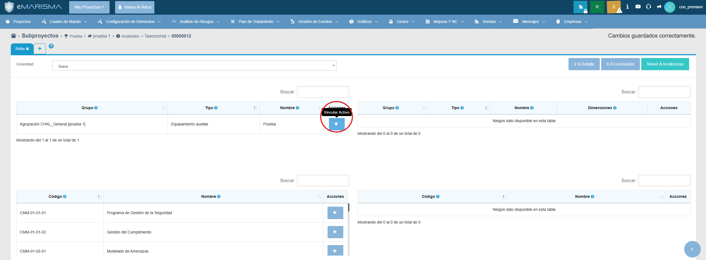
### ¿Que se recibe al entrar en esta sección?
```
GET /incidente/cargarDimensionesClear?activo=1&incidente=3 HTTP/1.1
Host: 172.20.48.129:8090
User-Agent: Mozilla/5.0 (Windows NT 10.0; Win64; x64) AppleWebKit/537.36 (KHTML, like Gecko) Chrome/142.0.0.0 Safari/537.36 Edg/142.0.0.0
Accept: */*
X-Requested-With: XMLHttpRequest
Referer: http://172.20.48.129:8090/incidente/index/3
Accept-Encoding: gzip, deflate, br
Accept-Language: es,es-ES;q=0.9,en;q=0.8,en-GB;q=0.7,en-US;q=0.6
Cookie: _ga=GA1.1.1791792627.1762429181; _gid=GA1.1.1977960298.1762429181; JSESSIONID=510A6D0C8E31CEAE7E9E874B51848694; _ga_55LR48RTVX=GS2.1.s1762499598$o2$g1$t1762500456$j60$l0$h0
Connection: keep-alive
```
Tras pulsar el botón, va a aparecer el cuadro de diálogo de Añadir Activo en el que vamos a tener que introducir las dimensiones. 

#### Respuesta al realizar la petición

```
{"dim":{"19":16},"activo":13,"msg":"ok"}
```

## 10. Rellenar formulario de dimensiones y guardar
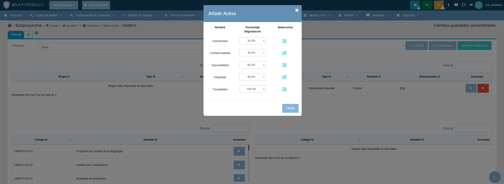
Al rellenar las dimensiones:
```
GET /incidente/vincularActivo?dimension=19&activo=&incidente=3&porcentaje=16&vincular=false&activoAux=1 HTTP/1.1
Host: 172.20.48.129:8090
User-Agent: Mozilla/5.0 (Windows NT 10.0; Win64; x64) AppleWebKit/537.36 (KHTML, like Gecko) Chrome/142.0.0.0 Safari/537.36 Edg/142.0.0.0
Accept: */*
X-Requested-With: XMLHttpRequest
Referer: http://172.20.48.129:8090/incidente/index/3
Accept-Encoding: gzip, deflate, br
Accept-Language: es,es-ES;q=0.9,en;q=0.8,en-GB;q=0.7,en-US;q=0.6
Cookie: _ga=GA1.1.1791792627.1762429181; _gid=GA1.1.1977960298.1762429181; JSESSIONID=510A6D0C8E31CEAE7E9E874B51848694; _ga_55LR48RTVX=GS2.1.s1762499598$o2$g1$t1762500456$j60$l0$h0
Connection: keep-alive
```

#### Respuesta al realizar la petición

```
{"msg":"creado","activo":16}
```

#### Petición realizada para vincular un control

```
GET /incidente/vincularControl
```

#### Respuesta al realizar la petición

```
{"msg":"noVinculado"}
```

#### Petición para recalcular

```
POST /recalculate
```

#### Respuesta al realizar la petición

```
{"mensaje":"ok"}
```

#### Cargar tabla de controles implicados
```
GET /incidente/cargarTablaControlesImplicados/1?incidente=3&draw=4&columns%5B0%5D%5Bdata%5D=0&columns%5B0%5D%5Bname%5D=&columns%5B0%5D%5Bsearchable%5D=false&columns%5B0%5D%5Borderable%5D=true&columns%5B0%5D%5Bsearch%5D%5Bvalue%5D=&columns%5B0%5D%5Bsearch%5D%5Bregex%5D=false&columns%5B1%5D%5Bdata%5D=&columns%5B1%5D%5Bname%5D=&columns%5B1%5D%5Bsearchable%5D=true&columns%5B1%5D%5Borderable%5D=true&columns%5B1%5D%5Bsearch%5D%5Bvalue%5D=&columns%5B1%5D%5Bsearch%5D%5Bregex%5D=false&columns%5B2%5D%5Bdata%5D=&columns%5B2%5D%5Bname%5D=&columns%5B2%5D%5Bsearchable%5D=true&columns%5B2%5D%5Borderable%5D=true&columns%5B2%5D%5Bsearch%5D%5Bvalue%5D=&columns%5B2%5D%5Bsearch%5D%5Bregex%5D=false&columns%5B3%5D%5Bdata%5D=&columns%5B3%5D%5Bname%5D=&columns%5B3%5D%5Bsearchable%5D=true&columns%5B3%5D%5Borderable%5D=true&columns%5B3%5D%5Bsearch%5D%5Bvalue%5D=&columns%5B3%5D%5Bsearch%5D%5Bregex%5D=false&columns%5B4%5D%5Bdata%5D=&columns%5B4%5D%5Bname%5D=&columns%5B4%5D%5Bsearchable%5D=true&columns%5B4%5D%5Borderable%5D=false&columns%5B4%5D%5Bsearch%5D%5Bvalue%5D=&columns%5B4%5D%5Bsearch%5D%5Bregex%5D=false&order%5B0%5D%5Bcolumn%5D=1&order%5B0%5D%5Bdir%5D=asc&start=0&length=-1&search%5Bvalue%5D=&search%5Bregex%5D=false&_=1762500456161 HTTP/1.1
Host: 172.20.48.129:8090
User-Agent: Mozilla/5.0 (Windows NT 10.0; Win64; x64) AppleWebKit/537.36 (KHTML, like Gecko) Chrome/142.0.0.0 Safari/537.36 Edg/142.0.0.0
Accept: application/json, text/javascript, */*; q=0.01
X-Requested-With: XMLHttpRequest
Referer: http://172.20.48.129:8090/incidente/index/3
Accept-Encoding: gzip, deflate, br
Accept-Language: es,es-ES;q=0.9,en;q=0.8,en-GB;q=0.7,en-US;q=0.6
Cookie: _ga=GA1.1.1791792627.1762429181; _gid=GA1.1.1977960298.1762429181; JSESSIONID=510A6D0C8E31CEAE7E9E874B51848694; _ga_55LR48RTVX=GS2.1.s1762499598$o2$g1$t1762500456$j60$l0$h0
Connection: keep-alive
```
#### Cargar tabla de controles no implicados
```
GET /incidente/cargarTablaControlesNoImplicados/1?incidente=3&draw=4&columns%5B0%5D%5Bdata%5D=0&columns%5B0%5D%5Bname%5D=&columns%5B0%5D%5Bsearchable%5D=false&columns%5B0%5D%5Borderable%5D=true&columns%5B0%5D%5Bsearch%5D%5Bvalue%5D=&columns%5B0%5D%5Bsearch%5D%5Bregex%5D=false&columns%5B1%5D%5Bdata%5D=&columns%5B1%5D%5Bname%5D=&columns%5B1%5D%5Bsearchable%5D=true&columns%5B1%5D%5Borderable%5D=true&columns%5B1%5D%5Bsearch%5D%5Bvalue%5D=&columns%5B1%5D%5Bsearch%5D%5Bregex%5D=false&columns%5B2%5D%5Bdata%5D=&columns%5B2%5D%5Bname%5D=&columns%5B2%5D%5Bsearchable%5D=true&columns%5B2%5D%5Borderable%5D=true&columns%5B2%5D%5Bsearch%5D%5Bvalue%5D=&columns%5B2%5D%5Bsearch%5D%5Bregex%5D=false&columns%5B3%5D%5Bdata%5D=&columns%5B3%5D%5Bname%5D=&columns%5B3%5D%5Bsearchable%5D=true&columns%5B3%5D%5Borderable%5D=true&columns%5B3%5D%5Bsearch%5D%5Bvalue%5D=&columns%5B3%5D%5Bsearch%5D%5Bregex%5D=false&columns%5B4%5D%5Bdata%5D=&columns%5B4%5D%5Bname%5D=&columns%5B4%5D%5Bsearchable%5D=false&columns%5B4%5D%5Borderable%5D=false&columns%5B4%5D%5Bsearch%5D%5Bvalue%5D=&columns%5B4%5D%5Bsearch%5D%5Bregex%5D=false&columns%5B5%5D%5Bdata%5D=&columns%5B5%5D%5Bname%5D=&columns%5B5%5D%5Bsearchable%5D=true&columns%5B5%5D%5Borderable%5D=false&columns%5B5%5D%5Bsearch%5D%5Bvalue%5D=&columns%5B5%5D%5Bsearch%5D%5Bregex%5D=false&order%5B0%5D%5Bcolumn%5D=1&order%5B0%5D%5Bdir%5D=asc&start=0&length=-1&search%5Bvalue%5D=&search%5Bregex%5D=false&_=1762500456159 HTTP/1.1
Host: 172.20.48.129:8090
User-Agent: Mozilla/5.0 (Windows NT 10.0; Win64; x64) AppleWebKit/537.36 (KHTML, like Gecko) Chrome/142.0.0.0 Safari/537.36 Edg/142.0.0.0
Accept: application/json, text/javascript, */*; q=0.01
X-Requested-With: XMLHttpRequest
Referer: http://172.20.48.129:8090/incidente/index/3
Accept-Encoding: gzip, deflate, br
Accept-Language: es,es-ES;q=0.9,en;q=0.8,en-GB;q=0.7,en-US;q=0.6
Cookie: _ga=GA1.1.1791792627.1762429181; _gid=GA1.1.1977960298.1762429181; JSESSIONID=510A6D0C8E31CEAE7E9E874B51848694; _ga_55LR48RTVX=GS2.1.s1762499598$o2$g1$t1762500456$j60$l0$h0
Connection: keep-alive
```
#### Cargar tabla de activos no implicados
```
GET /incidente/cargarTablaActivosNoImplicados/1?incidente=3&draw=4&columns%5B0%5D%5Bdata%5D=0&columns%5B0%5D%5Bname%5D=&columns%5B0%5D%5Bsearchable%5D=false&columns%5B0%5D%5Borderable%5D=true&columns%5B0%5D%5Bsearch%5D%5Bvalue%5D=&columns%5B0%5D%5Bsearch%5D%5Bregex%5D=false&columns%5B1%5D%5Bdata%5D=&columns%5B1%5D%5Bname%5D=&columns%5B1%5D%5Bsearchable%5D=true&columns%5B1%5D%5Borderable%5D=true&columns%5B1%5D%5Bsearch%5D%5Bvalue%5D=&columns%5B1%5D%5Bsearch%5D%5Bregex%5D=false&columns%5B2%5D%5Bdata%5D=&columns%5B2%5D%5Bname%5D=&columns%5B2%5D%5Bsearchable%5D=true&columns%5B2%5D%5Borderable%5D=true&columns%5B2%5D%5Bsearch%5D%5Bvalue%5D=&columns%5B2%5D%5Bsearch%5D%5Bregex%5D=false&columns%5B3%5D%5Bdata%5D=&columns%5B3%5D%5Bname%5D=&columns%5B3%5D%5Bsearchable%5D=true&columns%5B3%5D%5Borderable%5D=true&columns%5B3%5D%5Bsearch%5D%5Bvalue%5D=&columns%5B3%5D%5Bsearch%5D%5Bregex%5D=false&columns%5B4%5D%5Bdata%5D=4&columns%5B4%5D%5Bname%5D=&columns%5B4%5D%5Bsearchable%5D=false&columns%5B4%5D%5Borderable%5D=true&columns%5B4%5D%5Bsearch%5D%5Bvalue%5D=&columns%5B4%5D%5Bsearch%5D%5Bregex%5D=false&columns%5B5%5D%5Bdata%5D=5&columns%5B5%5D%5Bname%5D=&columns%5B5%5D%5Bsearchable%5D=false&columns%5B5%5D%5Borderable%5D=true&columns%5B5%5D%5Bsearch%5D%5Bvalue%5D=&columns%5B5%5D%5Bsearch%5D%5Bregex%5D=false&columns%5B6%5D%5Bdata%5D=&columns%5B6%5D%5Bname%5D=&columns%5B6%5D%5Bsearchable%5D=true&columns%5B6%5D%5Borderable%5D=true&columns%5B6%5D%5Bsearch%5D%5Bvalue%5D=&columns%5B6%5D%5Bsearch%5D%5Bregex%5D=false&columns%5B7%5D%5Bdata%5D=&columns%5B7%5D%5Bname%5D=&columns%5B7%5D%5Bsearchable%5D=true&columns%5B7%5D%5Borderable%5D=true&columns%5B7%5D%5Bsearch%5D%5Bvalue%5D=&columns%5B7%5D%5Bsearch%5D%5Bregex%5D=false&columns%5B8%5D%5Bdata%5D=&columns%5B8%5D%5Bname%5D=&columns%5B8%5D%5Bsearchable%5D=true&columns%5B8%5D%5Borderable%5D=true&columns%5B8%5D%5Bsearch%5D%5Bvalue%5D=&columns%5B8%5D%5Bsearch%5D%5Bregex%5D=false&columns%5B9%5D%5Bdata%5D=9&columns%5B9%5D%5Bname%5D=&columns%5B9%5D%5Bsearchable%5D=false&columns%5B9%5D%5Borderable%5D=true&columns%5B9%5D%5Bsearch%5D%5Bvalue%5D=&columns%5B9%5D%5Bsearch%5D%5Bregex%5D=false&columns%5B10%5D%5Bdata%5D=&columns%5B10%5D%5Bname%5D=&columns%5B10%5D%5Bsearchable%5D=true&columns%5B10%5D%5Borderable%5D=false&columns%5B10%5D%5Bsearch%5D%5Bvalue%5D=&columns%5B10%5D%5Bsearch%5D%5Bregex%5D=false&order%5B0%5D%5Bcolumn%5D=2&order%5B0%5D%5Bdir%5D=asc&start=0&length=-1&search%5Bvalue%5D=&search%5Bregex%5D=false&_=1762500456160 HTTP/1.1
Host: 172.20.48.129:8090
User-Agent: Mozilla/5.0 (Windows NT 10.0; Win64; x64) AppleWebKit/537.36 (KHTML, like Gecko) Chrome/142.0.0.0 Safari/537.36 Edg/142.0.0.0
Accept: application/json, text/javascript, */*; q=0.01
X-Requested-With: XMLHttpRequest
Referer: http://172.20.48.129:8090/incidente/index/3
Accept-Encoding: gzip, deflate, br
Accept-Language: es,es-ES;q=0.9,en;q=0.8,en-GB;q=0.7,en-US;q=0.6
Cookie: _ga=GA1.1.1791792627.1762429181; _gid=GA1.1.1977960298.1762429181; JSESSIONID=510A6D0C8E31CEAE7E9E874B51848694; _ga_55LR48RTVX=GS2.1.s1762499598$o2$g1$t1762500456$j60$l0$h0
Connection: keep-alive
```
#### Cargar tabla de activos implicados
```
GET /incidente/cargarTablaActivosImplicados/1?incidente=3&draw=1&columns%5B0%5D%5Bdata%5D=0&columns%5B0%5D%5Bname%5D=&columns%5B0%5D%5Bsearchable%5D=false&columns%5B0%5D%5Borderable%5D=true&columns%5B0%5D%5Bsearch%5D%5Bvalue%5D=&columns%5B0%5D%5Bsearch%5D%5Bregex%5D=false&columns%5B1%5D%5Bdata%5D=&columns%5B1%5D%5Bname%5D=&columns%5B1%5D%5Bsearchable%5D=true&columns%5B1%5D%5Borderable%5D=true&columns%5B1%5D%5Bsearch%5D%5Bvalue%5D=&columns%5B1%5D%5Bsearch%5D%5Bregex%5D=false&columns%5B2%5D%5Bdata%5D=&columns%5B2%5D%5Bname%5D=&columns%5B2%5D%5Bsearchable%5D=true&columns%5B2%5D%5Borderable%5D=true&columns%5B2%5D%5Bsearch%5D%5Bvalue%5D=&columns%5B2%5D%5Bsearch%5D%5Bregex%5D=false&columns%5B3%5D%5Bdata%5D=&columns%5B3%5D%5Bname%5D=&columns%5B3%5D%5Bsearchable%5D=true&columns%5B3%5D%5Borderable%5D=false&columns%5B3%5D%5Bsearch%5D%5Bvalue%5D=&columns%5B3%5D%5Bsearch%5D%5Bregex%5D=false&columns%5B4%5D%5Bdata%5D=&columns%5B4%5D%5Bname%5D=&columns%5B4%5D%5Bsearchable%5D=true&columns%5B4%5D%5Borderable%5D=false&columns%5B4%5D%5Bsearch%5D%5Bvalue%5D=&columns%5B4%5D%5Bsearch%5D%5Bregex%5D=false&columns%5B5%5D%5Bdata%5D=&columns%5B5%5D%5Bname%5D=&columns%5B5%5D%5Bsearchable%5D=true&columns%5B5%5D%5Borderable%5D=false&columns%5B5%5D%5Bsearch%5D%5Bvalue%5D=&columns%5B5%5D%5Bsearch%5D%5Bregex%5D=false&order%5B0%5D%5Bcolumn%5D=2&order%5B0%5D%5Bdir%5D=asc&start=0&length=-1&search%5Bvalue%5D=&search%5Bregex%5D=false&_=1762501352234 HTTP/1.1
Host: 172.20.48.129:8090
User-Agent: Mozilla/5.0 (Windows NT 10.0; Win64; x64) AppleWebKit/537.36 (KHTML, like Gecko) Chrome/142.0.0.0 Safari/537.36 Edg/142.0.0.0
Accept: application/json, text/javascript, */*; q=0.01
X-Requested-With: XMLHttpRequest
Referer: http://172.20.48.129:8090/incidente/index/3
Accept-Encoding: gzip, deflate, br
Accept-Language: es,es-ES;q=0.9,en;q=0.8,en-GB;q=0.7,en-US;q=0.6
Cookie: _ga=GA1.1.1791792627.1762429181; _gid=GA1.1.1977960298.1762429181; JSESSIONID=510A6D0C8E31CEAE7E9E874B51848694; _ga_55LR48RTVX=GS2.1.s1762499598$o2$g1$t1762501352$j60$l0$h0
Connection: keep-alive
```
#### Respuesta al rellenar las dimensiones
```
HTTP/1.1 200 
X-Frame-Options: DENY
X-Application-Context: application:production:9003
Content-Type: application/json;charset=UTF-8
Date: Fri, 07 Nov 2025 11:55:25 GMT
Keep-Alive: timeout=20
Connection: keep-alive
Content-Length: 1109

{"sEcho":null,"iTotalRecords":1,"iTotalDisplayRecords":1,"aaData":[[5,{"id":1,"estado":"cerrado","cobertura":0.0,"deleted":false,"exito":0.0,"respuestas":[{"id":64},{"id":66},{"id":2},{"id":21},{"id":43},{"id":4},{"id":11},{"id":20},{"id":14},{"id":10},{"id":53},{"id":30},{"id":47},{"id":68},{"id":29},{"id":62},{"id":56},{"id":65},{"id":36},{"id":50},{"id":23},{"id":41},{"id":5},{"id":25},{"id":44},{"id":28},{"id":59},{"id":57},{"id":67},{"id":16},{"id":32},{"id":1},{"id":9},{"id":40},{"id":13},{"id":12},{"id":46},{"id":69},{"id":3},{"id":49},{"id":48},{"id":51},{"id":52},{"id":6},{"id":26},{"id":70},{"id":24},{"id":31},{"id":38},{"id":61},{"id":27},{"id":33},{"id":34},{"id":35},{"id":7},{"id":17},{"id":19},{"id":60},{"id":42},{"id":45},{"id":54},{"id":63},{"id":15},{"id":39},{"id":22},{"id":55},{"id":58},{"id":8},{"id":71},{"id":37},{"id":18}],"nombreGrupoActivos":"Grupo General","incidentesActivo":[{"id":4},{"id":3},{"id":2},{"id":5},{"id":1}],"subproyecto":{"id":1},"activosAuditoria":[{"id":1}],"nombre":"Agrupación CHKL_General [prueba 1]"},"Equipamiento auxiliar","Prueba","[[A]]",null]]}
```

## 11. Vincular control (para cada control existente)
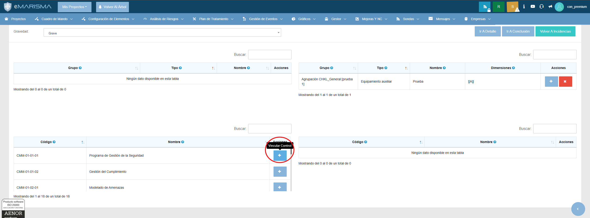
### ¿Qué se recibe al entrar en esta sección?
#### Cargar tabla de controles implicados
```
GET /incidente/cargarTablaControlesImplicados/1?incidente=3&draw=2&columns%5B0%5D%5Bdata%5D=0&columns%5B0%5D%5Bname%5D=&columns%5B0%5D%5Bsearchable%5D=false&columns%5B0%5D%5Borderable%5D=true&columns%5B0%5D%5Bsearch%5D%5Bvalue%5D=&columns%5B0%5D%5Bsearch%5D%5Bregex%5D=false&columns%5B1%5D%5Bdata%5D=&columns%5B1%5D%5Bname%5D=&columns%5B1%5D%5Bsearchable%5D=true&columns%5B1%5D%5Borderable%5D=true&columns%5B1%5D%5Bsearch%5D%5Bvalue%5D=&columns%5B1%5D%5Bsearch%5D%5Bregex%5D=false&columns%5B2%5D%5Bdata%5D=&columns%5B2%5D%5Bname%5D=&columns%5B2%5D%5Bsearchable%5D=true&columns%5B2%5D%5Borderable%5D=true&columns%5B2%5D%5Bsearch%5D%5Bvalue%5D=&columns%5B2%5D%5Bsearch%5D%5Bregex%5D=false&columns%5B3%5D%5Bdata%5D=&columns%5B3%5D%5Bname%5D=&columns%5B3%5D%5Bsearchable%5D=true&columns%5B3%5D%5Borderable%5D=true&columns%5B3%5D%5Bsearch%5D%5Bvalue%5D=&columns%5B3%5D%5Bsearch%5D%5Bregex%5D=false&columns%5B4%5D%5Bdata%5D=&columns%5B4%5D%5Bname%5D=&columns%5B4%5D%5Bsearchable%5D=true&columns%5B4%5D%5Borderable%5D=false&columns%5B4%5D%5Bsearch%5D%5Bvalue%5D=&columns%5B4%5D%5Bsearch%5D%5Bregex%5D=false&order%5B0%5D%5Bcolumn%5D=1&order%5B0%5D%5Bdir%5D=asc&start=0&length=-1&search%5Bvalue%5D=&search%5Bregex%5D=false&_=1762501352238 HTTP/1.1
Host: 172.20.48.129:8090
User-Agent: Mozilla/5.0 (Windows NT 10.0; Win64; x64) AppleWebKit/537.36 (KHTML, like Gecko) Chrome/142.0.0.0 Safari/537.36 Edg/142.0.0.0
Accept: application/json, text/javascript, */*; q=0.01
X-Requested-With: XMLHttpRequest
Referer: http://172.20.48.129:8090/incidente/index/3
Accept-Encoding: gzip, deflate, br
Accept-Language: es,es-ES;q=0.9,en;q=0.8,en-GB;q=0.7,en-US;q=0.6
Cookie: _ga=GA1.1.1791792627.1762429181; _gid=GA1.1.1977960298.1762429181; JSESSIONID=510A6D0C8E31CEAE7E9E874B51848694; _ga_55LR48RTVX=GS2.1.s1762499598$o2$g1$t1762501785$j60$l0$h0
Connection: keep-alive
```
#### Cargar tabla de controles no implicados
```
GET /incidente/cargarTablaControlesNoImplicados/1?incidente=3&draw=2&columns%5B0%5D%5Bdata%5D=0&columns%5B0%5D%5Bname%5D=&columns%5B0%5D%5Bsearchable%5D=false&columns%5B0%5D%5Borderable%5D=true&columns%5B0%5D%5Bsearch%5D%5Bvalue%5D=&columns%5B0%5D%5Bsearch%5D%5Bregex%5D=false&columns%5B1%5D%5Bdata%5D=&columns%5B1%5D%5Bname%5D=&columns%5B1%5D%5Bsearchable%5D=true&columns%5B1%5D%5Borderable%5D=true&columns%5B1%5D%5Bsearch%5D%5Bvalue%5D=&columns%5B1%5D%5Bsearch%5D%5Bregex%5D=false&columns%5B2%5D%5Bdata%5D=&columns%5B2%5D%5Bname%5D=&columns%5B2%5D%5Bsearchable%5D=true&columns%5B2%5D%5Borderable%5D=true&columns%5B2%5D%5Bsearch%5D%5Bvalue%5D=&columns%5B2%5D%5Bsearch%5D%5Bregex%5D=false&columns%5B3%5D%5Bdata%5D=&columns%5B3%5D%5Bname%5D=&columns%5B3%5D%5Bsearchable%5D=true&columns%5B3%5D%5Borderable%5D=true&columns%5B3%5D%5Bsearch%5D%5Bvalue%5D=&columns%5B3%5D%5Bsearch%5D%5Bregex%5D=false&columns%5B4%5D%5Bdata%5D=&columns%5B4%5D%5Bname%5D=&columns%5B4%5D%5Bsearchable%5D=false&columns%5B4%5D%5Borderable%5D=false&columns%5B4%5D%5Bsearch%5D%5Bvalue%5D=&columns%5B4%5D%5Bsearch%5D%5Bregex%5D=false&columns%5B5%5D%5Bdata%5D=&columns%5B5%5D%5Bname%5D=&columns%5B5%5D%5Bsearchable%5D=true&columns%5B5%5D%5Borderable%5D=false&columns%5B5%5D%5Bsearch%5D%5Bvalue%5D=&columns%5B5%5D%5Bsearch%5D%5Bregex%5D=false&order%5B0%5D%5Bcolumn%5D=1&order%5B0%5D%5Bdir%5D=asc&start=0&length=-1&search%5Bvalue%5D=&search%5Bregex%5D=false&_=1762501352237 HTTP/1.1
Host: 172.20.48.129:8090
User-Agent: Mozilla/5.0 (Windows NT 10.0; Win64; x64) AppleWebKit/537.36 (KHTML, like Gecko) Chrome/142.0.0.0 Safari/537.36 Edg/142.0.0.0
Accept: application/json, text/javascript, */*; q=0.01
X-Requested-With: XMLHttpRequest
Referer: http://172.20.48.129:8090/incidente/index/3
Accept-Encoding: gzip, deflate, br
Accept-Language: es,es-ES;q=0.9,en;q=0.8,en-GB;q=0.7,en-US;q=0.6
Cookie: _ga=GA1.1.1791792627.1762429181; _gid=GA1.1.1977960298.1762429181; JSESSIONID=510A6D0C8E31CEAE7E9E874B51848694; _ga_55LR48RTVX=GS2.1.s1762499598$o2$g1$t1762501785$j60$l0$h0
Connection: keep-alive
```
#### Respuesta a la petición de vincular control:
```
HTTP/1.1 200 
X-Frame-Options: DENY
X-Application-Context: application:production:9003
Content-Type: application/json;charset=UTF-8
Date: Fri, 07 Nov 2025 12:00:20 GMT
Keep-Alive: timeout=20
Connection: keep-alive
Content-Length: 318

{"sEcho":null,"iTotalRecords":1,"iTotalDisplayRecords":1,"aaData":[[55,"CMM-01-01-01","Programa de Gestión de la Seguridad","Esta práctica restringe los tipos de cambios permitidos, cuándo se pueden realizar esos cambios, los procesos de aprobación y cómo manejar los escenarios de cambios de emergencia.",null]]}
```
## 12. Ir a conclusión
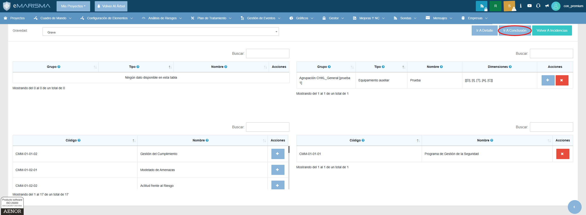
### ¿Qué se recibe al entrar en esta sección?
```
GET /evento/conclusion/3 HTTP/1.1
Host: 172.20.48.129:8090
Upgrade-Insecure-Requests: 1
User-Agent: Mozilla/5.0 (Windows NT 10.0; Win64; x64) AppleWebKit/537.36 (KHTML, like Gecko) Chrome/142.0.0.0 Safari/537.36 Edg/142.0.0.0
Accept: text/html,application/xhtml+xml,application/xml;q=0.9,image/avif,image/webp,image/apng,*/*;q=0.8,application/signed-exchange;v=b3;q=0.7
Referer: http://172.20.48.129:8090/incidente/index/3
Accept-Encoding: gzip, deflate, br
Accept-Language: es,es-ES;q=0.9,en;q=0.8,en-GB;q=0.7,en-US;q=0.6
Cookie: _ga=GA1.1.1791792627.1762429181; _gid=GA1.1.1977960298.1762429181; JSESSIONID=510A6D0C8E31CEAE7E9E874B51848694; _ga_55LR48RTVX=GS2.1.s1762499598$o2$g1$t1762501785$j60$l0$h0
Connection: keep-alive
```

## 13. Rellenar formulario, guardar y cerrar
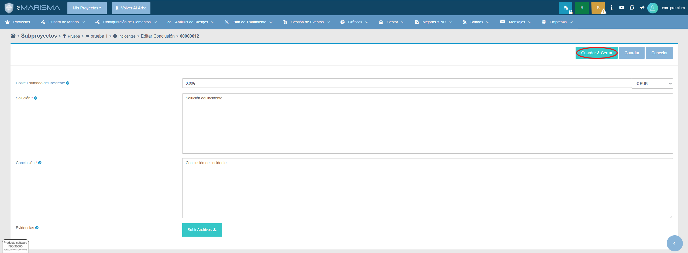
### ¿Qué se recibe al entrar en esta sección?
#### Guardar y cerrar
```
POST /evento/save/3 HTTP/1.1
Host: 172.20.48.129:8090
Content-Length: 1187
Cache-Control: max-age=0
Origin: http://172.20.48.129:8090
Content-Type: multipart/form-data; boundary=----WebKitFormBoundaryVBepmDttZU1AThSV
Upgrade-Insecure-Requests: 1
User-Agent: Mozilla/5.0 (Windows NT 10.0; Win64; x64) AppleWebKit/537.36 (KHTML, like Gecko) Chrome/142.0.0.0 Safari/537.36 Edg/142.0.0.0
Accept: text/html,application/xhtml+xml,application/xml;q=0.9,image/avif,image/webp,image/apng,*/*;q=0.8,application/signed-exchange;v=b3;q=0.7
Referer: http://172.20.48.129:8090/evento/conclusion/3
Accept-Encoding: gzip, deflate, br
Accept-Language: es,es-ES;q=0.9,en;q=0.8,en-GB;q=0.7,en-US;q=0.6
Cookie: _ga=GA1.1.1791792627.1762429181; _gid=GA1.1.1977960298.1762429181; JSESSIONID=510A6D0C8E31CEAE7E9E874B51848694; _gat_gtag_UA_97814751_2=1; _ga_55LR48RTVX=GS2.1.s1762499598$o2$g1$t1762502460$j60$l0$h0
Connection: keep-alive

------WebKitFormBoundaryVBepmDttZU1AThSV
Content-Disposition: form-data; name="save"

Guardar
------WebKitFormBoundaryVBepmDttZU1AThSV
Content-Disposition: form-data; name="id"

3
------WebKitFormBoundaryVBepmDttZU1AThSV
Content-Disposition: form-data; name="version"

2
------WebKitFormBoundaryVBepmDttZU1AThSV
Content-Disposition: form-data; name="subproyecto"

1
------WebKitFormBoundaryVBepmDttZU1AThSV
Content-Disposition: form-data; name="tipo"

conclusion
------WebKitFormBoundaryVBepmDttZU1AThSV
Content-Disposition: form-data; name="cerrar"

true
------WebKitFormBoundaryVBepmDttZU1AThSV
Content-Disposition: form-data; name="coste"

0.00€
------WebKitFormBoundaryVBepmDttZU1AThSV
Content-Disposition: form-data; name="myCurrency"

EUR
------WebKitFormBoundaryVBepmDttZU1AThSV
Content-Disposition: form-data; name="solucion"

Solución
------WebKitFormBoundaryVBepmDttZU1AThSV
Content-Disposition: form-data; name="conclusion"

Conclusión
------WebKitFormBoundaryVBepmDttZU1AThSV
Content-Disposition: form-data; name="evidencias[]"; filename=""
Content-Type: application/octet-stream


------WebKitFormBoundaryVBepmDttZU1AThSV--
```
```
GET /evento/index/1 HTTP/1.1
Host: 172.20.48.129:8090
Cache-Control: max-age=0
Upgrade-Insecure-Requests: 1
User-Agent: Mozilla/5.0 (Windows NT 10.0; Win64; x64) AppleWebKit/537.36 (KHTML, like Gecko) Chrome/142.0.0.0 Safari/537.36 Edg/142.0.0.0
Accept: text/html,application/xhtml+xml,application/xml;q=0.9,image/avif,image/webp,image/apng,*/*;q=0.8,application/signed-exchange;v=b3;q=0.7
Referer: http://172.20.48.129:8090/evento/conclusion/3
Accept-Encoding: gzip, deflate, br
Accept-Language: es,es-ES;q=0.9,en;q=0.8,en-GB;q=0.7,en-US;q=0.6
Cookie: _ga=GA1.1.1791792627.1762429181; _gid=GA1.1.1977960298.1762429181; JSESSIONID=510A6D0C8E31CEAE7E9E874B51848694; _ga_55LR48RTVX=GS2.1.s1762499598$o2$g1$t1762502460$j60$l0$h0
Connection: keep-alive
```

#### Cargar tabla de eventos
```
GET /evento/cargarEventoTabla/1?draw=1&columns%5B0%5D%5Bdata%5D=0&columns%5B0%5D%5Bname%5D=&columns%5B0%5D%5Bsearchable%5D=false&columns%5B0%5D%5Borderable%5D=true&columns%5B0%5D%5Bsearch%5D%5Bvalue%5D=&columns%5B0%5D%5Bsearch%5D%5Bregex%5D=false&columns%5B1%5D%5Bdata%5D=1&columns%5B1%5D%5Bname%5D=&columns%5B1%5D%5Bsearchable%5D=true&columns%5B1%5D%5Borderable%5D=true&columns%5B1%5D%5Bsearch%5D%5Bvalue%5D=&columns%5B1%5D%5Bsearch%5D%5Bregex%5D=false&columns%5B2%5D%5Bdata%5D=2&columns%5B2%5D%5Bname%5D=&columns%5B2%5D%5Bsearchable%5D=true&columns%5B2%5D%5Borderable%5D=true&columns%5B2%5D%5Bsearch%5D%5Bvalue%5D=&columns%5B2%5D%5Bsearch%5D%5Bregex%5D=false&columns%5B3%5D%5Bdata%5D=3&columns%5B3%5D%5Bname%5D=&columns%5B3%5D%5Bsearchable%5D=true&columns%5B3%5D%5Borderable%5D=true&columns%5B3%5D%5Bsearch%5D%5Bvalue%5D=&columns%5B3%5D%5Bsearch%5D%5Bregex%5D=false&columns%5B4%5D%5Bdata%5D=4&columns%5B4%5D%5Bname%5D=&columns%5B4%5D%5Bsearchable%5D=true&columns%5B4%5D%5Borderable%5D=true&columns%5B4%5D%5Bsearch%5D%5Bvalue%5D=&columns%5B4%5D%5Bsearch%5D%5Bregex%5D=false&columns%5B5%5D%5Bdata%5D=5&columns%5B5%5D%5Bname%5D=&columns%5B5%5D%5Bsearchable%5D=true&columns%5B5%5D%5Borderable%5D=true&columns%5B5%5D%5Bsearch%5D%5Bvalue%5D=&columns%5B5%5D%5Bsearch%5D%5Bregex%5D=false&columns%5B6%5D%5Bdata%5D=6&columns%5B6%5D%5Bname%5D=&columns%5B6%5D%5Bsearchable%5D=true&columns%5B6%5D%5Borderable%5D=true&columns%5B6%5D%5Bsearch%5D%5Bvalue%5D=&columns%5B6%5D%5Bsearch%5D%5Bregex%5D=false&columns%5B7%5D%5Bdata%5D=7&columns%5B7%5D%5Bname%5D=&columns%5B7%5D%5Bsearchable%5D=true&columns%5B7%5D%5Borderable%5D=true&columns%5B7%5D%5Bsearch%5D%5Bvalue%5D=&columns%5B7%5D%5Bsearch%5D%5Bregex%5D=false&columns%5B8%5D%5Bdata%5D=&columns%5B8%5D%5Bname%5D=&columns%5B8%5D%5Bsearchable%5D=true&columns%5B8%5D%5Borderable%5D=false&columns%5B8%5D%5Bsearch%5D%5Bvalue%5D=&columns%5B8%5D%5Bsearch%5D%5Bregex%5D=false&order%5B0%5D%5Bcolumn%5D=1&order%5B0%5D%5Bdir%5D=asc&start=0&length=10&search%5Bvalue%5D=&search%5Bregex%5D=false&_=1762502595427 HTTP/1.1
Host: 172.20.48.129:8090
User-Agent: Mozilla/5.0 (Windows NT 10.0; Win64; x64) AppleWebKit/537.36 (KHTML, like Gecko) Chrome/142.0.0.0 Safari/537.36 Edg/142.0.0.0
Accept: application/json, text/javascript, */*; q=0.01
X-Requested-With: XMLHttpRequest
Referer: http://172.20.48.129:8090/evento/index/1
Accept-Encoding: gzip, deflate, br
Accept-Language: es,es-ES;q=0.9,en;q=0.8,en-GB;q=0.7,en-US;q=0.6
Cookie: _ga=GA1.1.1791792627.1762429181; _gid=GA1.1.1977960298.1762429181; JSESSIONID=510A6D0C8E31CEAE7E9E874B51848694; _ga_55LR48RTVX=GS2.1.s1762499598$o2$g1$t1762502460$j60$l0$h0; _gat_UA-97814751-2=1
Connection: keep-alive
```

## 14. Recalcular (opción 1)
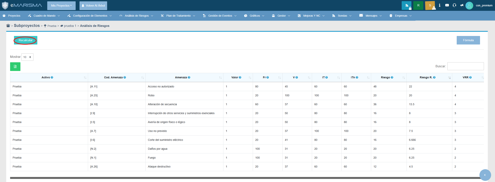
Entramos en la sección "Análisis de riesgos" y a continuación pulsamos el botón "Recalcular".
### ¿Qué se recibe al entrar en esta sección?
#### Generar análisis de riesgo
```
POST /analisisRiesgo/generarAnalisisRiesgoMin/1 HTTP/1.1
Host: 172.20.48.129:8090
Content-Length: 0
User-Agent: Mozilla/5.0 (Windows NT 10.0; Win64; x64) AppleWebKit/537.36 (KHTML, like Gecko) Chrome/142.0.0.0 Safari/537.36 Edg/142.0.0.0
Accept: */*
X-Requested-With: XMLHttpRequest
Origin: http://172.20.48.129:8090
Referer: http://172.20.48.129:8090/analisisRiesgo/index/1
Accept-Encoding: gzip, deflate, br
Accept-Language: es,es-ES;q=0.9,en;q=0.8,en-GB;q=0.7,en-US;q=0.6
Cookie: _ga=GA1.1.1791792627.1762429181; _gid=GA1.1.1977960298.1762429181; JSESSIONID=510A6D0C8E31CEAE7E9E874B51848694; _ga_55LR48RTVX=GS2.1.s1762499598$o2$g1$t1762502855$j60$l0$h0
Connection: keep-alive
```
#### Cargar análisis de riesgo
```
GET /analisisRiesgo/cargarAnalisisRiesgoTabla/1?from=index&draw=2&columns%5B0%5D%5Bdata%5D=0&columns%5B0%5D%5Bname%5D=&columns%5B0%5D%5Bsearchable%5D=false&columns%5B0%5D%5Borderable%5D=true&columns%5B0%5D%5Bsearch%5D%5Bvalue%5D=&columns%5B0%5D%5Bsearch%5D%5Bregex%5D=false&columns%5B1%5D%5Bdata%5D=1&columns%5B1%5D%5Bname%5D=&columns%5B1%5D%5Bsearchable%5D=true&columns%5B1%5D%5Borderable%5D=true&columns%5B1%5D%5Bsearch%5D%5Bvalue%5D=&columns%5B1%5D%5Bsearch%5D%5Bregex%5D=false&columns%5B2%5D%5Bdata%5D=2&columns%5B2%5D%5Bname%5D=&columns%5B2%5D%5Bsearchable%5D=true&columns%5B2%5D%5Borderable%5D=true&columns%5B2%5D%5Bsearch%5D%5Bvalue%5D=&columns%5B2%5D%5Bsearch%5D%5Bregex%5D=false&columns%5B3%5D%5Bdata%5D=3&columns%5B3%5D%5Bname%5D=&columns%5B3%5D%5Bsearchable%5D=true&columns%5B3%5D%5Borderable%5D=true&columns%5B3%5D%5Bsearch%5D%5Bvalue%5D=&columns%5B3%5D%5Bsearch%5D%5Bregex%5D=false&columns%5B4%5D%5Bdata%5D=4&columns%5B4%5D%5Bname%5D=&columns%5B4%5D%5Bsearchable%5D=true&columns%5B4%5D%5Borderable%5D=true&columns%5B4%5D%5Bsearch%5D%5Bvalue%5D=&columns%5B4%5D%5Bsearch%5D%5Bregex%5D=false&columns%5B5%5D%5Bdata%5D=5&columns%5B5%5D%5Bname%5D=&columns%5B5%5D%5Bsearchable%5D=true&columns%5B5%5D%5Borderable%5D=true&columns%5B5%5D%5Bsearch%5D%5Bvalue%5D=&columns%5B5%5D%5Bsearch%5D%5Bregex%5D=false&columns%5B6%5D%5Bdata%5D=6&columns%5B6%5D%5Bname%5D=&columns%5B6%5D%5Bsearchable%5D=true&columns%5B6%5D%5Borderable%5D=true&columns%5B6%5D%5Bsearch%5D%5Bvalue%5D=&columns%5B6%5D%5Bsearch%5D%5Bregex%5D=false&columns%5B7%5D%5Bdata%5D=7&columns%5B7%5D%5Bname%5D=&columns%5B7%5D%5Bsearchable%5D=true&columns%5B7%5D%5Borderable%5D=true&columns%5B7%5D%5Bsearch%5D%5Bvalue%5D=&columns%5B7%5D%5Bsearch%5D%5Bregex%5D=false&columns%5B8%5D%5Bdata%5D=&columns%5B8%5D%5Bname%5D=&columns%5B8%5D%5Bsearchable%5D=true&columns%5B8%5D%5Borderable%5D=false&columns%5B8%5D%5Bsearch%5D%5Bvalue%5D=&columns%5B8%5D%5Bsearch%5D%5Bregex%5D=false&columns%5B9%5D%5Bdata%5D=&columns%5B9%5D%5Bname%5D=&columns%5B9%5D%5Bsearchable%5D=true&columns%5B9%5D%5Borderable%5D=false&columns%5B9%5D%5Bsearch%5D%5Bvalue%5D=&columns%5B9%5D%5Bsearch%5D%5Bregex%5D=false&columns%5B10%5D%5Bdata%5D=&columns%5B10%5D%5Bname%5D=&columns%5B10%5D%5Bsearchable%5D=true&columns%5B10%5D%5Borderable%5D=false&columns%5B10%5D%5Bsearch%5D%5Bvalue%5D=&columns%5B10%5D%5Bsearch%5D%5Bregex%5D=false&columns%5B11%5D%5Bdata%5D=&columns%5B11%5D%5Bname%5D=&columns%5B11%5D%5Bsearchable%5D=true&columns%5B11%5D%5Borderable%5D=false&columns%5B11%5D%5Bsearch%5D%5Bvalue%5D=&columns%5B11%5D%5Bsearch%5D%5Bregex%5D=false&columns%5B12%5D%5Bdata%5D=&columns%5B12%5D%5Bname%5D=&columns%5B12%5D%5Bsearchable%5D=true&columns%5B12%5D%5Borderable%5D=false&columns%5B12%5D%5Bsearch%5D%5Bvalue%5D=&columns%5B12%5D%5Bsearch%5D%5Bregex%5D=false&columns%5B13%5D%5Bdata%5D=&columns%5B13%5D%5Bname%5D=&columns%5B13%5D%5Bsearchable%5D=true&columns%5B13%5D%5Borderable%5D=true&columns%5B13%5D%5Bsearch%5D%5Bvalue%5D=&columns%5B13%5D%5Bsearch%5D%5Bregex%5D=false&columns%5B14%5D%5Bdata%5D=&columns%5B14%5D%5Bname%5D=&columns%5B14%5D%5Bsearchable%5D=true&columns%5B14%5D%5Borderable%5D=true&columns%5B14%5D%5Bsearch%5D%5Bvalue%5D=&columns%5B14%5D%5Bsearch%5D%5Bregex%5D=false&columns%5B15%5D%5Bdata%5D=&columns%5B15%5D%5Bname%5D=&columns%5B15%5D%5Bsearchable%5D=true&columns%5B15%5D%5Borderable%5D=true&columns%5B15%5D%5Bsearch%5D%5Bvalue%5D=&columns%5B15%5D%5Bsearch%5D%5Bregex%5D=false&columns%5B16%5D%5Bdata%5D=&columns%5B16%5D%5Bname%5D=&columns%5B16%5D%5Bsearchable%5D=true&columns%5B16%5D%5Borderable%5D=true&columns%5B16%5D%5Bsearch%5D%5Bvalue%5D=&columns%5B16%5D%5Bsearch%5D%5Bregex%5D=false&columns%5B17%5D%5Bdata%5D=&columns%5B17%5D%5Bname%5D=&columns%5B17%5D%5Bsearchable%5D=true&columns%5B17%5D%5Borderable%5D=true&columns%5B17%5D%5Bsearch%5D%5Bvalue%5D=&columns%5B17%5D%5Bsearch%5D%5Bregex%5D=false&columns%5B18%5D%5Bdata%5D=&columns%5B18%5D%5Bname%5D=&columns%5B18%5D%5Bsearchable%5D=true&columns%5B18%5D%5Borderable%5D=true&columns%5B18%5D%5Bsearch%5D%5Bvalue%5D=&columns%5B18%5D%5Bsearch%5D%5Bregex%5D=false&order%5B0%5D%5Bcolumn%5D=16&order%5B0%5D%5Bdir%5D=desc&start=0&length=10&search%5Bvalue%5D=&search%5Bregex%5D=false&_=1762502851864 HTTP/1.1
Host: 172.20.48.129:8090
User-Agent: Mozilla/5.0 (Windows NT 10.0; Win64; x64) AppleWebKit/537.36 (KHTML, like Gecko) Chrome/142.0.0.0 Safari/537.36 Edg/142.0.0.0
Accept: application/json, text/javascript, */*; q=0.01
X-Requested-With: XMLHttpRequest
Referer: http://172.20.48.129:8090/analisisRiesgo/index/1
Accept-Encoding: gzip, deflate, br
Accept-Language: es,es-ES;q=0.9,en;q=0.8,en-GB;q=0.7,en-US;q=0.6
Cookie: _ga=GA1.1.1791792627.1762429181; _gid=GA1.1.1977960298.1762429181; JSESSIONID=510A6D0C8E31CEAE7E9E874B51848694; _ga_55LR48RTVX=GS2.1.s1762499598$o2$g1$t1762502855$j60$l0$h0
Connection: keep-alive
```
## 15. Recalcular (opción 2)
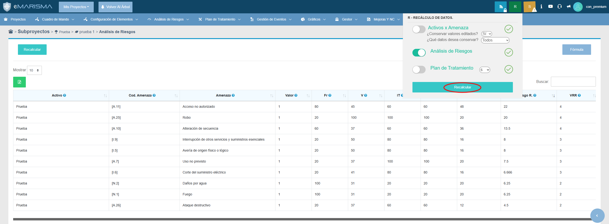
### ¿Qué se recibe al entrar en esta sección?
```
POST /RSA/recalculateRAjax/1?acam=false&ar=true&pdt=false&vr=6&con=true&po=true&dim=true HTTP/1.1
Host: 172.20.48.129:8090
Content-Length: 0
User-Agent: Mozilla/5.0 (Windows NT 10.0; Win64; x64) AppleWebKit/537.36 (KHTML, like Gecko) Chrome/142.0.0.0 Safari/537.36 Edg/142.0.0.0
Accept: */*
X-Requested-With: XMLHttpRequest
Origin: http://172.20.48.129:8090
Referer: http://172.20.48.129:8090/analisisRiesgo/index/1
Accept-Encoding: gzip, deflate, br
Accept-Language: es,es-ES;q=0.9,en;q=0.8,en-GB;q=0.7,en-US;q=0.6
Cookie: _ga=GA1.1.1791792627.1762429181; _gid=GA1.1.1977960298.1762429181; JSESSIONID=510A6D0C8E31CEAE7E9E874B51848694; _ga_55LR48RTVX=GS2.1.s1762499598$o2$g1$t1762502855$j60$l0$h0
Connection: keep-alive
```
## 16. Cerrar sesión
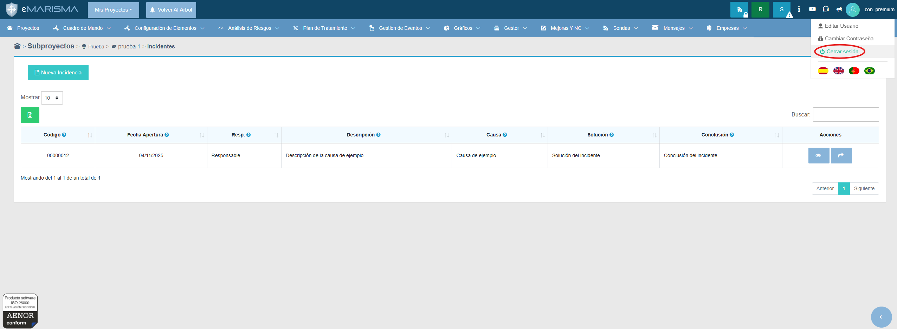
### ¿Qué se recibe al entrar en esta sección?
#### Cerrar sesión
```
GET /logout/index HTTP/1.1
Host: 172.20.48.129:8090
Upgrade-Insecure-Requests: 1
User-Agent: Mozilla/5.0 (Windows NT 10.0; Win64; x64) AppleWebKit/537.36 (KHTML, like Gecko) Chrome/142.0.0.0 Safari/537.36 Edg/142.0.0.0
Accept: text/html,application/xhtml+xml,application/xml;q=0.9,image/avif,image/webp,image/apng,*/*;q=0.8,application/signed-exchange;v=b3;q=0.7
Referer: http://172.20.48.129:8090/analisisRiesgo/index/1
Accept-Encoding: gzip, deflate, br
Accept-Language: es,es-ES;q=0.9,en;q=0.8,en-GB;q=0.7,en-US;q=0.6
Cookie: _ga=GA1.1.1791792627.1762429181; _gid=GA1.1.1977960298.1762429181; JSESSIONID=510A6D0C8E31CEAE7E9E874B51848694; _ga_55LR48RTVX=GS2.1.s1762499598$o2$g1$t1762502855$j60$l0$h0
Connection: keep-alive
```
#### Desconectar
```
GET /logoff HTTP/1.1
Host: 172.20.48.129:8090
Upgrade-Insecure-Requests: 1
User-Agent: Mozilla/5.0 (Windows NT 10.0; Win64; x64) AppleWebKit/537.36 (KHTML, like Gecko) Chrome/142.0.0.0 Safari/537.36 Edg/142.0.0.0
Accept: text/html,application/xhtml+xml,application/xml;q=0.9,image/avif,image/webp,image/apng,*/*;q=0.8,application/signed-exchange;v=b3;q=0.7
Referer: http://172.20.48.129:8090/analisisRiesgo/index/1
Accept-Encoding: gzip, deflate, br
Accept-Language: es,es-ES;q=0.9,en;q=0.8,en-GB;q=0.7,en-US;q=0.6
Cookie: _ga=GA1.1.1791792627.1762429181; _gid=GA1.1.1977960298.1762429181; JSESSIONID=510A6D0C8E31CEAE7E9E874B51848694; _ga_55LR48RTVX=GS2.1.s1762499598$o2$g1$t1762502855$j60$l0$h0
Connection: keep-alive
```
#### Cargar la página de login
```
GET /login/auth HTTP/1.1
Host: 172.20.48.129:8090
Upgrade-Insecure-Requests: 1
User-Agent: Mozilla/5.0 (Windows NT 10.0; Win64; x64) AppleWebKit/537.36 (KHTML, like Gecko) Chrome/142.0.0.0 Safari/537.36 Edg/142.0.0.0
Accept: text/html,application/xhtml+xml,application/xml;q=0.9,image/avif,image/webp,image/apng,*/*;q=0.8,application/signed-exchange;v=b3;q=0.7
Referer: http://172.20.48.129:8090/analisisRiesgo/index/1
Accept-Encoding: gzip, deflate, br
Accept-Language: es,es-ES;q=0.9,en;q=0.8,en-GB;q=0.7,en-US;q=0.6
Cookie: _ga=GA1.1.1791792627.1762429181; _gid=GA1.1.1977960298.1762429181; _ga_55LR48RTVX=GS2.1.s1762499598$o2$g1$t1762502855$j60$l0$h0; JSESSIONID=4FDDA0257242BFA72EB9534C9662AA43
Connection: keep-alive
```
```
GET /login/authAjax HTTP/1.1
Host: 172.20.48.129:8090
User-Agent: Mozilla/5.0 (Windows NT 10.0; Win64; x64) AppleWebKit/537.36 (KHTML, like Gecko) Chrome/142.0.0.0 Safari/537.36 Edg/142.0.0.0
Accept: */*
X-Requested-With: XMLHttpRequest
Referer: http://172.20.48.129:8090/analisisRiesgo/index/1
Accept-Encoding: gzip, deflate, br
Accept-Language: es,es-ES;q=0.9,en;q=0.8,en-GB;q=0.7,en-US;q=0.6
Cookie: _ga=GA1.1.1791792627.1762429181; _gid=GA1.1.1977960298.1762429181; _ga_55LR48RTVX=GS2.1.s1762499598$o2$g1$t1762502855$j60$l0$h0; JSESSIONID=4FDDA0257242BFA72EB9534C9662AA43
Connection: keep-alive
```
#### Cargar recaptcha
```
GET /recaptcha/api2/anchor?ar=1&k=6LdOYd4UAAAAAJp9Z0nvTa8Y9xYqE_q6NHRSGiyq&co=aHR0cDovLzE3Mi4yMC40OC4xMjk6ODA5MA..&hl=es&v=naPR4A6FAh-yZLuCX253WaZq&size=invisible&anchor-ms=20000&execute-ms=15000&cb=5rnq8s1m7x57 HTTP/2
Host: www.google.com
Cookie: _GRECAPTCHA=09ADiQh0dbcaH8oDFGLI8hlny2zL0M4kQNYXpYA0-OuFUg-qpZhBZTsA3lf3Vl8F9w6FK_hdInM-TOauBsQe_ciP8
Sec-Ch-Ua: "Chromium";v="142", "Microsoft Edge";v="142", "Not_A Brand";v="99"
Sec-Ch-Ua-Mobile: ?0
Sec-Ch-Ua-Platform: "Windows"
Upgrade-Insecure-Requests: 1
User-Agent: Mozilla/5.0 (Windows NT 10.0; Win64; x64) AppleWebKit/537.36 (KHTML, like Gecko) Chrome/142.0.0.0 Safari/537.36 Edg/142.0.0.0
Accept: text/html,application/xhtml+xml,application/xml;q=0.9,image/avif,image/webp,image/apng,*/*;q=0.8,application/signed-exchange;v=b3;q=0.7
Sec-Fetch-Site: cross-site
Sec-Fetch-Mode: navigate
Sec-Fetch-Dest: iframe
Sec-Fetch-Storage-Access: active
Referer: http://172.20.48.129:8090/
Accept-Encoding: gzip, deflate, br
Accept-Language: es,es-ES;q=0.9,en;q=0.8,en-GB;q=0.7,en-US;q=0.6
Priority: u=0, i
```
```
GET /recaptcha/api2/anchor?ar=1&k=6LdOYd4UAAAAAJp9Z0nvTa8Y9xYqE_q6NHRSGiyq&co=aHR0cDovLzE3Mi4yMC40OC4xMjk6ODA5MA..&hl=es&v=naPR4A6FAh-yZLuCX253WaZq&size=invisible&anchor-ms=20000&execute-ms=15000&cb=icmhf5ec4300 HTTP/2
Host: www.google.com
Cookie: _GRECAPTCHA=09ADiQh0dbcaH8oDFGLI8hlny2zL0M4kQNYXpYA0-OuFUg-qpZhBZTsA3lf3Vl8F9w6FK_hdInM-TOauBsQe_ciP8
Sec-Ch-Ua: "Chromium";v="142", "Microsoft Edge";v="142", "Not_A Brand";v="99"
Sec-Ch-Ua-Mobile: ?0
Sec-Ch-Ua-Platform: "Windows"
Upgrade-Insecure-Requests: 1
User-Agent: Mozilla/5.0 (Windows NT 10.0; Win64; x64) AppleWebKit/537.36 (KHTML, like Gecko) Chrome/142.0.0.0 Safari/537.36 Edg/142.0.0.0
Accept: text/html,application/xhtml+xml,application/xml;q=0.9,image/avif,image/webp,image/apng,*/*;q=0.8,application/signed-exchange;v=b3;q=0.7
Sec-Fetch-Site: cross-site
Sec-Fetch-Mode: navigate
Sec-Fetch-Dest: iframe
Sec-Fetch-Storage-Access: active
Referer: http://172.20.48.129:8090/
Accept-Encoding: gzip, deflate, br
Accept-Language: es,es-ES;q=0.9,en;q=0.8,en-GB;q=0.7,en-US;q=0.6
Priority: u=0, i
```
```
POST /recaptcha/api2/clr?k=6LdOYd4UAAAAAJp9Z0nvTa8Y9xYqE_q6NHRSGiyq HTTP/2
Host: www.google.com
Content-Length: 124
Sec-Ch-Ua-Platform: "Windows"
User-Agent: Mozilla/5.0 (Windows NT 10.0; Win64; x64) AppleWebKit/537.36 (KHTML, like Gecko) Chrome/142.0.0.0 Safari/537.36 Edg/142.0.0.0
Sec-Ch-Ua: "Chromium";v="142", "Microsoft Edge";v="142", "Not_A Brand";v="99"
Sec-Ch-Ua-Mobile: ?0
Accept: */*
Origin: http://172.20.48.129:8090
Sec-Fetch-Site: cross-site
Sec-Fetch-Mode: no-cors
Sec-Fetch-Dest: empty
Referer: http://172.20.48.129:8090/
Accept-Encoding: gzip, deflate, br
Accept-Language: es,es-ES;q=0.9,en;q=0.8,en-GB;q=0.7,en-US;q=0.6
Priority: u=1, i


(6LdOYd4UAAAAAJp9Z0nvTa8Y9xYqE_q6NHRSGiyq
```
