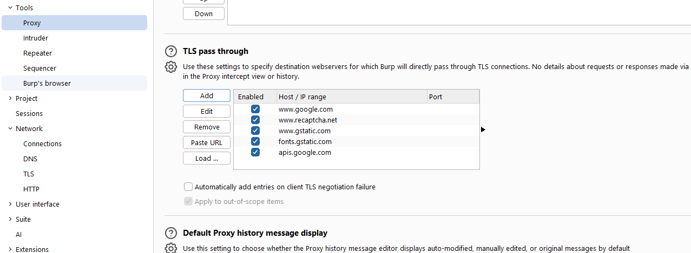

# Instalación del Certificado CA de Burp Suite en Windows

Para instalar el certificado CA de Burp Suite en Windows, descarga el certificado y sigue los pasos para importarlo en el almacén de certificados de tu sistema.

## Pasos para instalar el certificado CA de Burp Suite

### 1. Descargar el certificado
- Inicia Burp Suite y asegúrate de que el proxy esté configurado en el puerto de escucha predeterminado (127.0.0.1:8080).
- En la interfaz de Burp, ve a la pestaña "Proxy" y selecciona "Interceptar".
- Luego, haz clic en "Certificado CA" en la esquina superior derecha para descargar el archivo del certificado llamado "cacert.der".

### 2. Instalar el certificado
- Haz doble clic en el archivo "cacert.der" descargado para abrirlo. Esto abrirá el "Visor de certificados".
- Haz clic en el botón "Instalar certificado".

### 3. Seleccionar el almacén de certificados
- Elige "Usuario actual" si deseas que solo tu usuario confíe en el certificado, o "Máquina local" si deseas que todos los usuarios confíen en él.
- Asegúrate de seleccionar "Autoridades de certificación raíz de confianza" como el almacén donde se instalará el certificado.

### 4. Finalizar la instalación
- Haz clic en "Finalizar" para completar la instalación del certificado.
- Es posible que se te advierta sobre la seguridad; acepta la advertencia para continuar.
- Reinicia tu navegador para que los cambios surtan efecto. Esto debería afectar a todos los navegadores en tu computadora, aunque algunos navegadores como Firefox pueden requerir que agregues el certificado manualmente si utilizan su propio almacén de confianza.

## Verificación
Para verificar que la instalación fue exitosa:
- Abre un navegador y visita cualquier URL HTTPS.
- No deberías ver advertencias de seguridad, y la página debería cargarse normalmente.
- Si encuentras problemas, asegúrate de que el proxy de Burp esté configurado correctamente y que el certificado esté instalado en el almacén adecuado.

Siguiendo estos pasos, podrás instalar el certificado de Burp Suite en Windows y utilizarlo para interceptar el tráfico HTTPS sin problemas.

# TLS Passthrough

